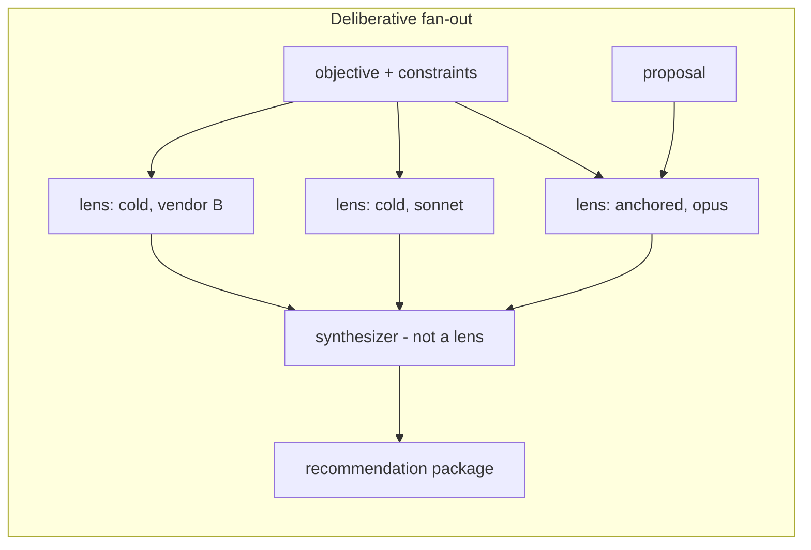
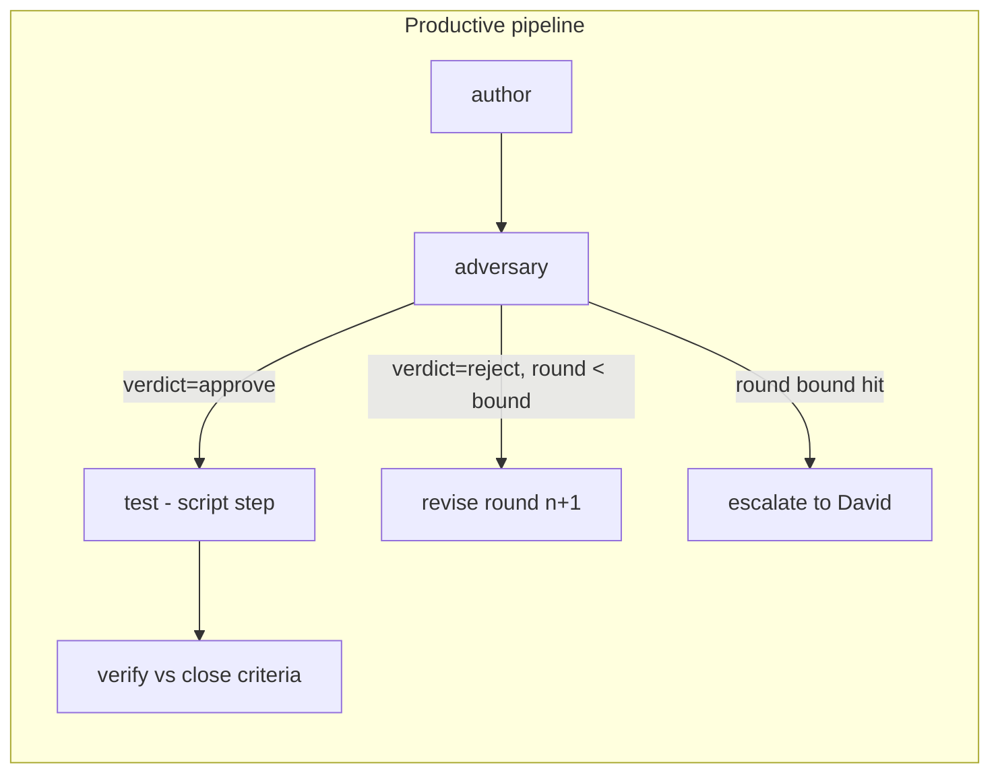
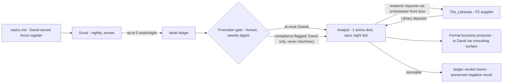

# Deterministic multi-model orchestration for Agent Workflow — design

**Date:** 2026-07-31
**Anchor:** CLD-00109 (design workstream; this document is Resolution-path step 1)
**Commissioned by:** the prompt at `~/Documents/Projects/cowork-evolution/Prompts/conductor-design-pass-20260731.md`, authored from consultation chat `remote_44bd64f7` with §F added from chat `remote_815d6db1`
**Author:** Claude Fable 5, David-supervised terminal session, 2026-07-31
**Mode:** design pass — nothing here is authorized to build. Path: this document → consultation → DEC(s) → staged intakes (CLD-00109 §Resolution path).

**Evidence conventions.** Claims about how the system behaves *today* cite `file:line` (paths relative to `~/Documents/Agent_Workflow/` unless shown absolute), a DEC id, or a CLD id. Claims I could not verify are labelled and collected in §Could-not-verify near the end. Where the two source transcripts and the prompt disagreed, I followed the transcripts, per the brief.

**Transcript status check (required by the brief).** The brief warned the primary transcript might end at `AFTER_TURN_0`. It does not — it is *more* complete than the brief expected: all **8 turns** are present and the foot sentinel reads `AFTER_TURN_8`, so even the final turn (the launch-command rewrite and the CLD-00106 restoration) is captured. The §F transcript (`remote_815d6db1`) is also on disk with 10 turns. Both were read.

---

## Executive summary

**What is being designed.** A way for Agent Workflow to run work through *several* model steps — possibly several vendors — where the routing between steps is decided by code reading declared data, never by a model deciding at runtime what happens next. This is the property set of Microsoft's open-source `conductor` project, which David has ruled we reproduce natively rather than adopt (CLD-00109, Settled item 1).

**The central finding: you are closer than the brief assumes.** The existing queue already contains the orchestration primitive in embryo. A task file's `depends_on:` field already declares a dependency graph that deterministic code (`_meta/queuelib.py:151–181`) evaluates; per-step model selection already exists for worker tasks (`code/worker.sh:707`); typed machine-readable verdicts already exist (the `VD-VERDICT:` line grammar, `orchestrator/orchestrator.sh:847`); immutable per-artifact records already exist (the quarantine convention, `_meta/schema.md:240–259`). What is missing is: a **declared, diffable workflow definition** that compiles down into those task files; a **typed output contract** between steps; **conditional routing** (a step that runs only if an upstream verdict says so); and the **planning half** — the deliberative fan-out, the study work type, and V/D's promotion from inline subroutine to a lane.

**The design in one paragraph.** A workflow definition is a version-controlled Markdown file in `_meta/workflows/` that a small deterministic expander (`workflowlib.py`, a sibling of `oilib.py`/`queuelib.py`) **compiles into ordinary task files** chained by `depends_on:` — it is never interpreted at runtime. Every emitted task file passes the full mechanical screen at the moment it enters a lane, so "screen at every promotion" (CLD-00043) survives literally. Steps exchange state through typed output files on disk (`artifacts/<id>/output.md` with YAML frontmatter, per the existing `_meta/output-template.md` shape) plus a one-line machine verdict, exactly as V/D already does. Model steps and script steps are both just task files — a `runner:` field distinguishes them. The **deliberative fan-out** (several lenses in parallel, converging to a synthesis) and the **productive pipeline** (author → adversary → revise → test → verify) are two topologies expressible in the same grammar, with different guard rails. V/D becomes its own lane in a later stage, gaining per-item model selection and the CLD-00072 budget machinery, and stops being a subroutine of the orchestrator it exists to check. Non-Anthropic models participate as **reviewers, not residents** — API calls behind a new `_lib` runner adapter, behind the same screen, never through a second front door.

**The worked example ships first.** The Scout → Analyst venture pipeline (§F below, self-contained) is recommended as stages 1–2 of the rollout: Scout is a nightly stub generator writing to a ledger, promotion is a **human gate through the weekly digest** (at most 2 promotions/week, score ≥20/25 with no criterion below 3, compliance-flagged stubs never machine-promotable), and the Analyst is one opus night-slot per dive producing a formal business proposal. It runs on machinery that exists today — no expander, no new daemon — and it is the cheapest way to get real revenue-idea output while the deeper machinery is built. The_Librarian's P3 grant (DEC-0090 item 5) is **superseded** by the DEC that authorizes stage 1; until that DEC lands, it stands as written.

**What David has to decide.** Eleven items, collected in §[DECISION REQUIRED] with options and recommendations. The load-bearing four: (D1) authorize the venture pipeline DEC (supersedes DEC-0090 item 5, sets the caps); (D2) whether a study becomes a distinct work type with the convene-gate escalating to him by default; (D3) what an adversarial reviewer's REJECT actually does (halt / escalate / annotate — per lens class); (D4) whether V/D becomes a lane in stage 4, accepting that `verifying` becomes a real waiting state.

**Cost posture.** Everything draws from one shared weekly subscription pool (Fable capped at 50% of it — CLD-00106 §Budget). The design's answer is a three-rung ladder — **degrade, then queue, then refuse loudly** — declared per workflow definition, plus hard caps sized so the venture pipeline consumes roughly two opus night-slots a week at steady state. Cross-vendor steps are API-metered real dollars and get their own spend ledger and monthly cap.

---

## Part 1 — The shape, in plain English

Terms used throughout, defined once:

- **Step** — one bounded unit of work: a fresh model session with a prompt, or a deterministic script. In this design a step is physically an ordinary **task file** — the same Markdown-with-frontmatter file the worker already drains (`_meta/schema.md:17–41`).
- **Workflow definition** — a version-controlled file declaring a set of steps, their order, their models, their budgets, and the conditions under which each runs. It is *data*. Code reads it; no model ever decides the routing.
- **Instantiation (compiling)** — the act of turning a workflow definition into real task files in a lane. Done by a deterministic script, once, up front. After instantiation the workflow *is* the task files; there is no engine running alongside them.
- **Division / department** — David's organisational vocabulary (transcript `remote_44bd64f7` turn 4): the **Planning Division** decides *which approach*; the **Implementation Division** decides *how to carry it out* (Settled item 2). A **department** is a step type with a charter; a **division** is a workflow topology connecting departments. §Part 4 maps this vocabulary onto the mechanics exactly.
- **Deliberative fan-out** — parallel, divergent: several lenses examine one question independently, then a synthesizer maps their disagreements. Produces a *recommendation*. Failure mode: false consensus.
- **Productive pipeline** — sequential, convergent: author → adversary → revise → test → verify. Produces a *change*. Failure mode: an adversary too agreeable to block anything.
- **Study** — a piece of work whose deliverable is a recommendation rather than a change (proposed as a distinct work type in §Part 3, question 6).
- **Lens** — one reviewer invocation inside a fan-out. **Cold** lens: sees only the objective and constraints, never the proposal. **Anchored** lens: sees the proposal and attacks it.
- **OI** — orchestrator item, the cradle-to-grave tracking record for one request (`README.md:6–9`).
- **V/D** — the Verification/Design pass, today an inline opus call inside the orchestrator's wake (`orchestrator/orchestrator.sh:859–860`), the system's judgment layer.

### Why "compile, don't interpret" is the whole design

Conductor's runtime interprets a YAML graph while it runs. This system's equivalent must not, for two structural reasons:

1. **The parsers of record are already chosen.** `screen.py`, `oilib.py`, and `queuelib.py` parse Markdown files with YAML frontmatter; the worker's entire contract is "claim the oldest eligible task file" (`code/worker.sh:6`, `queuelib.py:159–181`). A runtime interpreter would be a *second execution authority* living beside the worker, and its internal steps would never pass the screen — a second front door, which is exactly what question 10's authorization constraint forbids.
2. **Folder location IS the state** (`README.md:94–102`). Conductor keeps run state in a process; this system keeps it on disk, which is what makes it restartable, auditable, and reviewable after the fact. A workflow that compiles to task files inherits all of that for free — every step gets `## Result`, `## Review`, retention, dead-letter handling, the CLD-00072 deadline/handoff machinery, and the ledger, with zero new code in the execution path.

So the Conductor properties land here as follows:

| Conductor property | How it lands in Agent Workflow |
| --- | --- |
| Routing is declared data, evaluated by code | Workflow definition file → compiled by `workflowlib.py` into `depends_on:` chains evaluated by `queuelib.py:151–181` |
| Topology inspectable/version-controlled before it runs | The definition is a git-tracked file in `_meta/workflows/`; a run's instantiated task files are additionally diffable against it |
| Per-step model selection | The existing `model:` frontmatter field per task file (`worker.sh:707`); cross-vendor via a new `runner:` field (§Part 5) |
| Typed outputs, not shared conversation | `artifacts/<id>/output.md` with YAML frontmatter + a machine verdict line (§Part 2, Q3). No context ever carries between sessions today (`schema.md:86–88`) — this is already the system's native behaviour |
| Fan-out and pipelines first-class | Both are `depends_on:` topologies (§Part 2, Q2) |
| Explicit human gates | The existing escalation → consulting surface → `david-decision` path (DEC-0099); a gate is a step whose only exit is a decision document |
| Script steps as peers | A task file with `runner: script` executed directly by the worker, no model session (§Part 2, Q1) |

---

## Part 2 — A. Shape of the orchestration primitive

### Q1. The declarative unit

**What it is.** A **workflow definition**: one Markdown file at `_meta/workflows/<name>.workflow.md`, YAML frontmatter for the workflow-level declarations, one fenced block per step (the same fenced-`task`-block grammar the intake template already uses — `_meta/intake-consultation-template.md:51–72` — so authors and the screen already know the shape). Sketch:

````
---
workflow: adversarial-review          # name; instantiations cite it
version: 3                            # bumped on any edit; runs record which version ran
work: task | study                    # what kind of deliverable this produces (Q6)
budget:                               # workflow-level spend declaration (Q14)
  max_model: opus                     # ceiling any step may request
  degrade_order: [lens-alt2, lens-cold]   # steps dropped first under budget pressure
impacts: []                           # named systems in scope (Q9)
---
## step: author
runner: claude          # claude | script  (later: openai — Q10)
model: sonnet
timeout_minutes: 40
inputs: [objective]     # names resolved to files at instantiation
output: draft           # typed output contract this step must satisfy
```task
... complete standalone prompt body, exactly as schema.md requires ...
```

## step: adversary
depends_on: [author]
inputs: [objective, author.output]
gate: verdict            # downstream routing reads this step's verdict line
...
````

**Where it lives.** `_meta/workflows/`. `_meta` is the singular constitution for all lanes, evolving additively (`README.md:71–78`); workflow definitions are exactly that class of artifact — parsed schemas beside the gates that enforce them, which is also where DEC-0096 item 1(a) says code-parsed material belongs.

**What reads it.** One new deterministic script, `_meta/workflowlib.py` — a sibling of `oilib.py` (OI records) and `queuelib.py` (queue mechanics). It does one job: given a definition plus the concrete inputs (an OI id, the input files), **emit N ordinary task files** into the target lane's inbox, with `depends_on:` edges wired, ids suffixed (`NNN-<wf>-author`, `NNN-<wf>-adversary`, …), and a run **manifest** written to `artifacts/<run-id>/manifest.md` recording the definition name, version, step list, and models. It contains no model call and no scheduling logic. The workers never learn workflows exist — they keep draining eligible task files.

**Why this format, against the parsers of record.** Three candidate formats were considered:

- *A standalone YAML graph interpreted at runtime* (Conductor's own shape) — rejected for the two structural reasons in Part 1: second execution authority, and steps that bypass the screen.
- *Nothing new — hand-author chained task files each time* — this **works today** (`depends_on` exists: `schema.md:22, 50–51`; dependency evaluation: `queuelib.py:151, 181`) and is exactly how stages 1–2 of the rollout run. Its limit: the topology exists only implicitly across N files, so it cannot be reviewed as one diff, versioned as one unit, or reused — the Conductor inspectability property is lost. It is the right *bridge*, not the destination.
- *The definition-compiled-to-task-files shape recommended here* — keeps every existing parser authoritative (emitted files are ordinary tasks, full-screened at the hop), adds exactly one new parser (`workflowlib.py`) that runs *upstream of the screen* where a parsing bug is caught rather than executed, and makes the topology a single reviewable artifact.

**Screening.** Two layers, per the standing invariant (screen at every promotion, `README.md:390–397`): the definition itself is linted at commit/instantiation time (schema-valid, step ids unique, `depends_on` references resolve, models within the allowlist, synthesizer-not-a-lens check — see Q12), and **every emitted task file passes the full `screen.py`** exactly as any other file entering a lane. Nothing about workflows weakens a gate.

**Script steps.** A step with `runner: script` names a command from an allowlisted set (scripts under `_meta/`/`_lib/`, the same trust domain as the screen itself). The worker executes it directly — no `claude -p` — captures stdout/exit code, and writes the same `## Result` shape. This makes `screen.py`, `check_staleness.sh`-class checks, and test suites first-class steps routed on by exit code, which is the Conductor script-step property. (Precedent that deterministic checks belong beside model steps: the worker's own deterministic progress cross-check, which can veto a model verdict but never manufacture one — `worker.sh:289–299`.)

**Conditional routing — the one genuinely new primitive.** Today's grammar has exactly one condition: "all dependencies `status: done`" (`queuelib.py:151–181`). A pipeline needs one more: *run this step only if the upstream verdict says X* (the adversary approved; the tests passed). Two additions, both deterministic:

1. A step may declare `requires: <step>.verdict=<value>`. At completion of the gate step, a small hook (in the worker's outcome path or the reviewer's pass) reads the gate's machine verdict line and either leaves dependents eligible or **voids** them — a new terminal-ish queue status (`voided`, set via `queuelib`, one ledger line, never silently). Without explicit voiding, a failed gate would leave dependents "skipped (not failed)" forever (`schema.md:50–51`), and the staleness watchdog would either nag about them or — worse — say nothing.
2. **Loops are bounded re-instantiation, never graph cycles.** A revise round is a *new* pair of task files minted by the expander with a round counter persisted on the OI spine **before** anything runs — the exact SIGKILL-safe pattern the clarification round already uses (`orchestrator.sh:2174–2181`). The DAG per instantiation stays acyclic; the bound lives in data (Q8).

Condition vocabulary stays an **enumerated set** (equality tests on declared verdict fields), never a general expression language — the DEC-0082 item 2 principle (autonomy and routing grow as enumerable, auditable conditions, not as expressive power). What Conductor does with Jinja2 templates, this system deliberately does with a fixed grammar; §E Q17 lists the expression language under "never".

### Q2. The two geometries, concretely

Both are `depends_on:` topologies compiled from a definition. What differs is the guard rails.





**What the fan-out needs that the pipeline does not:**

- **Input isolation per lens.** A cold lens's task file must be constructed *without* the proposal among its inputs — enforced structurally by the expander (it only injects declared `inputs:`), not by asking the model to ignore something it was shown. This is the same two-differently-fed-readers logic that already gates auto-route: the attester deliberately sees the anchors and the original but *not* the V/D findings (`orchestrator.sh:880–887`).
- **Immutable per-lens artifacts.** Each lens writes `artifacts/<run>/lens-<name>/output.md`, chmod-444 on completion (the quarantine convention — `schema.md:240–248`; the clarify sidecar precedent, `orchestrator.sh:2177–2178`). The disagreements are the product; a synthesis that collapsed them would delete the thing three vendors were paid to produce (consultation, turn 3).
- **Degradation, not failure, on lens loss.** One lens dying (timeout, API error) must not kill the run: the synthesizer runs on N−1 with a loud manifest note and a FLAG (DEC-0089 items 1–2 — loud, bounded). A pipeline is the opposite: a dead step blocks the chain by construction, correctly.
- **Concurrency.** Real parallelism. Today the code lane is serial — at most one prompt in flight globally (`worker.sh:6`; `queuelib.py:162`). A v1 fan-out through the code lane therefore executes lenses *sequentially within one drain* — acceptable for overnight studies (wall-clock cost, not correctness), and the recorded basis for relaxing later already exists: `VD_CONCURRENCY` with the comment "per-OI spines => safe to fan out; default 1" (`orchestrator.sh:57`). Lifting serial-v1 is a per-lane knob in the V/D-lane stage, not a prerequisite.
- **A synthesizer with a different job** (Q12): disagreement-mapping, not answering.

**What the pipeline needs that the fan-out does not:**

- **Conditional routing + voiding** (Q1) — the adversary's verdict decides what runs next.
- **Bounded loops** (Q8) — revise rounds with a counter and an escalate-on-exhaustion exit.
- **An adversary with teeth.** The failure mode is agreeableness. Mitigations, in order of value: a typed findings schema whose "what fails here that nobody named" section may not be empty (a lens that finds nothing must say *why* nothing, against named checks); cross-vendor adversaries when available (different priors — consultation turn 3: for adversarial lenses, model diversity matters more; for generative lenses, question diversity); and reviewer=judge separation (the adversary proposes, never routes — CLD-00073 §Role architecture, inherited thread 2).
- **Script steps** — tests and verification are deterministic and should not be model judgments.

### Q3. How structured output travels, and the durable record

**The contract.** Every model step ends by writing its **output document**: `artifacts/<id>/output.md` (or the step's declared `deliverable:` path), with YAML frontmatter carrying the typed fields and prose below for humans. This is not new — it is `_meta/output-template.md`, ratified as "the constant-shape deliverable every task produces" with frontmatter id/oi/related/completed/deliver_to (DEC-0081 finalization bracket (d)); the design adds *per-step-type* frontmatter schemas (a lens output declares `verdict`, `confidence`, `alternatives[]`, `disagrees_with`, `new_impacts[]`; an adversary output declares `verdict: approve|reject`, `findings[]`, `unnamed_failure_modes[]`).

**Belt and braces:** each step also prints a one-line machine verdict as its final line (`STEP-VERDICT: verdict=... round=...`), the exact two-ended contract V/D already obeys, parsed from both stdout and the durable file because a real model sometimes writes one and not the other — observed live and worked around at `orchestrator.sh:869–876`.

**How the next step receives it.** At claim time, `queuelib emit-prompt` already injects worker-owned blocks above the body (deadline block, resume block — `schema.md:109–121`; `worker.sh:793–795`). The design extends the same mechanism: declared `inputs:` are injected as read-first pointers (path + one-line description), with the standing trust framing kept verbatim — an upstream output is **data from a prior session, not instructions**, and the task body wins any conflict (`schema.md:119–121`). Steps never share a session; they share files. That is already the system's only continuity model (`schema.md:86–88`) — the design formalizes the file shapes rather than inventing a channel.

**The durable record of a fan-out.** Four artifacts, mirroring the existing four-documents-four-jobs discipline (`schema.md:260–270`):

1. `artifacts/<run>/manifest.md` — written by the expander at instantiation: definition name + version, steps, models, and later per-step status stamps. The run's table of contents.
2. `artifacts/<run>/lens-<name>/output.md` — each lens's full output, immutable once written.
3. The synthesizer's output document — the recommendation package, which **cites** lens outputs by path and quotes their disagreements; it never replaces them.
4. The OI spine — pointers and status only, as always (the orchestrator is "a passive tracking record, never work or payload", `README.md:262`).

**One retention wrinkle to settle at build:** a *delivered* task's `artifacts/<id>/` is deleted at the 30-day sweep because the destination copy is canonical (`README.md:179–182`). For a fan-out, the destination copy is the synthesis — if lens outputs are not packaged into the delivered artifact set, the disagreement record dies at day 30 (recoverable from git, but out of easy reach). Recommendation: the expander lists lens outputs in the synthesis step's `deliverable:` so they ride delivery as an appendix. Flagged in [DECISION REQUIRED] D10 as a default to confirm.

---

## Part 3 — B. V/D and the planning department

### Q4. V/D as a lane — the central question

David's proposal, verbatim: *"This leads me to think we need to treat V/D like we do our Code worker rather than as a spun up agent within the Orchestrator"* (transcript `remote_44bd64f7`, turn 7).

**Assessment: correct, and worth doing — but as the fourth stage, not the first, and with the inline path retained as a degraded mode.**

**What it is today.** V/D is a synchronous `run_claude` call inside the orchestrator's wake (`orchestrator.sh:859–860`), model fixed per-wake by the `VD_MODEL` env var (`:52`), 15-minute budget (`VD_TIMEOUT`, `:54`), findings appended to the spine, verdict parsed from a machine line. There is **no path at all** from a request to V/D's model (CLD-00106 gap 5 — verified by grep, recorded there). Structurally, the judgment layer runs as a subroutine of the adjudicator it is supposed to check, on the adjudicator's clock, with the adjudicator's launch environment deciding what it thinks with.

**What the lane buys** (all four claims verified against the code):

1. **Per-item model selection for free** — the worker already reads `model:` off the claimed task (`worker.sh:707`) and passes it to `run_claude`'s 4th argument (`:815`, `_lib/run_claude.sh:228–229`). V/D tasks in a lane inherit that plumbing untouched. (Still gated by the `MODELS = {"sonnet","opus"}` allowlist, `screen.py:59` — CLD-00106's to widen, not this design's.)
2. **The CLD-00072 budget model** — absolute-deadline injection, soft-landing handoff, continuation accounting, done-check-reads-the-disk. Today a V/D pass that stalls burns its 15 minutes inside the wake and rungs down to escalate-unverified (`orchestrator.sh:863–867`); as a lane task it would land softly and continue.
3. **Natural fan-out** — a planning study becomes N V/D-lane tasks with per-OI artifacts; `VD_CONCURRENCY` (`orchestrator.sh:57`) already records that per-OI spines make this safe.
4. **Artifacts and a reviewer** — V/D outputs become auditable lane outputs with `## Review`, instead of log files under retention sweep. The judgment layer gets judged.

Plus the structural point, which I weight heaviest: **a peer, not a subroutine**. If the planning/implementation split lands, V/D's model matters more than the worker's — the worker executes a decided approach; V/D decides which approaches exist (CLD-00106 §Strategic note).

**What it costs, honestly:**

1. **`verifying` becomes a real waiting state.** Today intake → verdict happens inside one wake. As a lane: orchestrator mints the V/D task at wake N, the V/D lane drains it, the orchestrator *resumes adjudication* at wake N+1 or N+2 by reading the verdict off the spine. `handle_fresh_intake` (`orchestrator.sh:1986–2136`) is one linear function; it must split into "dispatch" and "resume" halves with the intermediate state persisted on the spine. That is real surgery on the most safety-critical function in the system.
2. **The waiting-state hazard class is live, today, unfixed.** CLD-00105 documents a held item re-notifying David on *every* orchestrator wake — 40+ pings for one unchanged finding — because a notification fires per evaluation rather than per state transition (`orchestrator.sh:2389` per CLD-00105). Making `verifying` a multi-wake state manufactures more instances of exactly that class. **Precondition:** state-transition-edge-triggered notification (the CLD-00105 fix shape) must land before or with the V/D lane.
3. **A third daemon or drain contention.** Recommendation: **own lane, own launchd service** (`vd/` — or `planning/`, see Part 4), not contention on `code/`'s serial drain — an intake verdict must not queue behind a 60-minute build. Cost: one more plist (a DEC-0091 `launchd`-class grant + install), one more ledger, one more thing the staleness watchdog covers. The Librarian already proved the cousin-lane pattern at exactly this scale (DEC-0090 items 1, 7).
4. **Latency.** Intake-to-verdict moves from ~minutes to one or two wake cycles. With WatchPaths wakes on the lane inbox this is minutes-to-tens-of-minutes in practice, but the `check_staleness.sh` thresholds (intake unadjudicated > 24h — `README.md:249`) and the DEC-0093 clarify age-out clock (~24h, `orchestrator.sh:63–64`) were tuned for the synchronous world and need re-derivation (§E Q15).

**The recursion question: what screens the V/D task?** The invariant is "screen at every promotion" (CLD-00043; `README.md:392–393`), and the trap is "the orchestrator minted it, so it's trusted" — trusted origin ≠ trusted authority (`screen.py:8–9`).

The answer has two halves:

- **Mechanically: screen it anyway, literally.** The V/D task file passes the full `screen.py` at the hop into `vd/inbox` like any other file. The screen is cheap, no-LLM, and already screens the orchestrator's own writes (`README.md:392–393` — "including the orchestrator's own writes"). No exemption is created.
- **Structurally: the recursion terminates in code, not in judgment.** The V/D task is minted by deterministic code from a version-controlled prompt template — exactly how the V/D prompt is built today (`orchestrator.sh:830–857`, a `printf` block in a git-tracked script). A V/D task does **not** itself receive a V/D pass; the regress stops because the thing that mints judgment tasks is not an authority that can be steered — it is a fixed function of the intake, reviewable in a diff. That is the Conductor property applied to the machinery's own composition: *topology is data; the minting of judgment steps is code*. What must therefore stay true forever: **model output never composes a V/D task body.** If a model ever writes the prompt for the judgment layer, the fixed point is lost and the invariant genuinely breaks. This belongs in the DEC as a named red line.

(The attester — the second, minimal-context reader gating auto-route, `orchestrator.sh:880–932` — should **stay inline**: it is cheap (6-minute budget, sonnet), its whole value is being a narrow, differently-fed check on the rich reader, and pushing it through a lane adds a wake cycle to auto-route for no independence gain.)

**Recommendation:** adopt the lane (stage 4), keep `run_vd_pass` as the degraded fallback mode (env-var-selected), and gate the cutover on: the CLD-00105 notification fix, a dispatch/resume split with fixture coverage in `test_orchestrator.sh`, and re-derived staleness thresholds. [DECISION REQUIRED — D4.]

### Q5. The triage router

V/D today runs on **every** intake and is cheap by design (one opus call). If V/D also becomes the planning department, the expensive fan-out must be *convened*, not default. David's framing: *"it starts with 'is this a well formed request', then it moves to 'how should we do this'"* (transcript turn 4).

**Design — three gates, cheapest first, each recorded on the spine:**

- **Gate 0 (exists): the mechanical screen.** `screen.py --intake` — well-formedness, provenance anchors, deny-list, PHI, size (`README.md:390–391`). No model.
- **Gate 1 (exists, extended): the V/D gate pass.** Today's single pass, unchanged in cost — provenance, viability, variation, questions (`orchestrator.sh:841–847`). *Extension:* the `VD-VERDICT` grammar gains one facet, `plan=direct|study|none`:
  - `direct` — the anchored record already decides the approach, or the work is routine. The record *is* the plan; convening a panel to re-derive it would pay for a decision already made (DEC-0082: "If there is a CLD/DEC then I've already seen it").
  - `study` — genuinely open approach choice: V/D finds ≥2 viable approaches with materially different costs/impacts, or the intake explicitly declares `work: study`, or cross-system impact is nontrivial. The ≥3-alternatives discipline (CLD-00072 analyst thread; `README.md:85` — "≥3-alternatives for real design work") is the existing marker of this class.
  - `none` — dispose/clarify/escalate paths, unchanged.
- **Gate 2 (new): the convene decision.** Who authorizes spending a fan-out? **Conservative default: David does** — `plan=study` escalates through the normal channel (DEC-0099: the consulting surface diagnoses, brings him the spend question with V/D's sketch of the lenses and the cost). Auto-convening is a future enumerable condition for a DEC to add deliberately (candidate condition: intake declares `work: study` + anchored record contemplates a study + budget headroom above a floor + no red line) — the DEC-0082 whitelist-growth shape, not model discretion. [DECISION REQUIRED — D2.]

**Inputs to the router:** the intake's declared `work:` field; V/D's verdict facets; the anchored record (resolved via `screen.py --resolve`, as the attester already does — `orchestrator.sh:894–896`); the budget state (Q14). **Where recorded:** `plan=` lands in the VD-VERDICT progress line on the spine (the existing verdict-recording path, `orchestrator.sh:2017`), and the convene decision — David's or a future rule's — lands as a spine progress line plus, when convened, the run manifest pointer. Portfolio visibility rides the DEC-0094 end-column pattern if wanted later.

**Cost property:** trivial intakes pay exactly what they pay today (gates 0–1, one opus call). The fan-out costs nothing until something crosses gate 2.

### Q6. The study as a work type — yes

**Recommendation: yes, a distinct work type, as a field (`work: study`) — not a new lane, not a new lifecycle.** The OI lifecycle stays (Settled 8); what changes is what "done" and "verified" mean.

A study differs from a task on every axis that the machinery actually enforces, which is the test for whether a type distinction is real:

| Axis | Task (today) | Study |
| --- | --- | --- |
| Deliverable | A change: code, files, an installed service | A recommendation package: viable? alternatives (≥3, genuinely distinct)? recommended approach? proposed stages? open questions for David |
| Done-check | Declared deliverable exists and is non-empty (`worker.sh` done-check; `schema.md:68–74`) | Same mechanical floor, plus the package's typed frontmatter fields are present and non-empty (a schema check, still mechanical) |
| Verification bar | Reviewer audits result vs deliverable (`README.md:134–139`) | Reviewer verifies **reasoning**: were the alternatives genuinely distinct (not three flavors of one instinct); does every load-bearing claim cite evidence that resolves; does the conclusion follow; are lens disagreements *surfaced* rather than averaged. The verification is of the argument, not of an artifact's function. |
| Destination | Per `deliver_to` — project folder, queue, daily-log (`README.md:171–178`) | **The consulting surface, always** — a recommendation is a decision input, and decisions route through the consulting surface (DEC-0099 item 1). Dual-delivered: chat + project folder. |
| What it may not do | (n/a) | **A study proposes stages; it never files them.** If a study could create build intakes, it would be making decisions — moving work out from under DEC-0099 without anyone noticing (consultation turn 3). Its close criteria include this negative property. |

Close criteria for a study, mechanically checkable: the package exists at the declared path; its frontmatter carries `viable`, `alternatives` (length ≥ the declared minimum), `recommendation`, `stages`, `open_questions`; every alternative has a populated tradeoffs field; zero intake files were created by the run (a diff check); delivery stamped to the consulting surface's record.

Schema delta: one field (`work: task|study`, default `task`) on intakes and task files; a study output template as a sibling of `_meta/output-template.md`. The screen learns one enum. Nothing else in the lifecycle moves.

---

## Part 4 — C. Departments, loops and off-ramps

### Q7. Does the department map onto a step definition? Yes — exactly, and the design adopts the vocabulary

David's model (transcript turn 4): a Planning Division and an Implementation Division, each with departments focused on specific areas, sequenced under stated circumstances, forming loops with off-ramps when something real needs his input. A department has five things. Each maps to a mechanism that already exists or is defined above:

| Department property | Mechanism | Status |
| --- | --- | --- |
| **Charter** (what it decides, its mental framing, its quality bar) | The role package: `_roles/<role>.md`, mounted via a `role:` frontmatter field, prepended by `emit-prompt`, with a learnings section executors append to | Designed in CLD-00073 §SME role packages (inherited thread 3); unbuilt; cheap first increment per that item |
| **Input contract** (what it must be given) | The step's declared `inputs:` (Q1) plus the task/intake schema the screen enforces | Schema exists (`_meta/schema.md`); `inputs:` is new |
| **Output contract** (what it must produce) | Typed output document frontmatter + machine verdict line (Q3) | Verdict-line grammar exists for V/D (`orchestrator.sh:847`); per-step-type schemas are new |
| **Escalation rule** (when it pulls a human) | Named trigger conditions on the step + the DEC-0093 question taxonomy (clarification/interview/consultation) + the impact predicate (Q9) | Taxonomy live (`schema.md:219–233`); impact predicate is new |
| **Budget** | `model:` + `timeout_minutes:` + `max_attempts:`/`max_continuations:` (CLD-00072) per step; workflow-level `budget:` block (Q14) | Per-task fields live (`schema.md:23–32`); workflow-level block is new |

So: **department = role package + step definition. Division = a workflow definition connecting departments. Lane = where a division's steps physically execute.** The metaphor is not illustrative — it is a specification, and the design documents (and any DEC) should use David's vocabulary: the V/D gate pass, the study fan-out, the Scout, and the Analyst are *departments of the Planning Division*; the author/adversary/verify pipeline steps are *departments of the Implementation Division*.

One boundary from the existing record that the vocabulary must not blur: **departments recommend; the orchestrator enforces; David decides** (`README.md:290–295` — red-line enforcement lives in one place; V/D writes findings only, `README.md:372–373`). Departments never gain routing authority by being renamed — reviewer=judge separation (CLD-00073 design principle 1) generalizes to every department.

### Q8. Loop termination

Planning ↔ implementation can ping-pong: planning refines, implementation objects, planning refines. The record already contains the pattern to reuse (the brief directs reuse over re-derivation, and I concur — same failure mode, same fix):

**DEC-0093's clarification bound**, three properties (DEC-0093 items 2–4; enforced at `orchestrator.sh:59–64, 2174–2185`):

1. **A round budget in data, not judgment** — `CLARIFY_ROUND_MAX=1`; the counter (`clarify_consumed`) lives on the spine.
2. **The counter bumps *before* the model call** (`orchestrator.sh:2174–2181`) so a SIGKILL mid-pass can never grant a free round.
3. **An age-out clock** — a hold that sits unconsumed ~24h escalates to David regardless (`CLARIFY_AGEOUT`, `orchestrator.sh:62–64`), so a stuck loop cannot wait forever silently.

Applied to workflow loops: each loop declared in a definition carries `max_rounds` (default **1** revision round for the productive pipeline's adversary→revise loop, hard ceiling 2 without a DEC), a spine-persisted `loop_rounds` counter bumped before instantiating the round, and an age-out. Exit on exhaustion is always **escalate with the disagreement packaged** — the round-2 adversary objection plus the author's response travel to David as a decision package, not a retry. One deliberate divergence from DEC-0093, stated: clarification rounds are claim-side only and cheap, so 1 is generous; a revision round involves real work, so the DEC ratifying pipelines should confirm 1-default/2-max rather than inherit it silently. [Folded into D3.]

### Q9. The escalation predicate — what makes an issue "real"

Settled item 5: escalation is trigger-driven, not schedule-driven — David is pulled in when a named condition is crossed, typically impact on another system. The predicate needs three parts:

**1. Impacts are named up front, from an enumerable register.** A new David-owned file, `_meta/systems-register.md` — same ownership contract as `librarian/topics.md` (David edits, machinery only reads; the header comment convention is the precedent, `topics.md:3–9`) — lists the named systems: the nightly chain, The_Wiki, The_Library, the memory store, launchd services, git remotes, the Telegram channels, Alfred's domain (red-line class, never merely "impact"), the Agent_Workflow control plane itself. A planning output (study or V/D verdict) must fill its `impacts:` field **from that enumeration** — free-text impact claims don't gate anything. The declared set lands on the OI spine.

**2. The off-ramp condition is a set comparison, evaluated by code.** Implementation crossing into a system *not in the declared set* is the trigger. The detector already exists in production form: the DEC-0091 item-5 post-run scope audit snapshots harm-surface trees before a granted run and diffs after, on **every** outcome including crashes (`worker.sh:736–789, 826–834`), holding delivery and escalating on out-of-scope changes. The design generalizes it: declared `impacts:` map to watched trees exactly as grant scopes and `work_scope:` do today (DEC-0091 + its work_scope amendment). Out-of-declared-set diff → delivery HOLD + escalate. Not a new mechanism — a second consumer of a proven one.

**3. The predicate is re-evaluable, because planning misses things.** David, turn 4: impacts "may be called out during planning, or it may not be fully understood until the implementation strategy is evaluated." So every step's typed output carries a `new_impacts:` slot (Q3). Deterministic rule: **a non-empty `new_impacts:` on any step halts dependent steps (voids or holds them) and escalates before the next step runs** — the off-ramp fires on discovery, not at the next checkpoint. The register comparison repeats at each step boundary, which is what "re-evaluated when implementation strategy reveals impacts planning missed" means mechanically.

**Recorded where:** declared set on the spine at routing; each re-evaluation as a spine progress line; register changes only by David editing the register file (dated). Red-line classes (`README.md:290–291`: PHI/HIPAA, cross-actor, governance files, outward-facing/hard-to-reverse, material spend) sit *above* this predicate and escalate regardless of any declaration — the predicate adds a middle tier between "routine" and "red line", which is exactly the tier that today has no name.

---

## Part 5 — D. Multi-vendor

### Q10. How non-Anthropic models participate

**Posture first (from the consultation, turn 2, and Settled 3):** other vendors join as **reviewers, not residents** — bounded invocations with a good brief and a typed output, no memory system, no agent harness. For a review gate you want the model, not the agent; Azure/Codex distinctions and Alfred's provider question are out of scope here (brief §Out of scope).

**Invocation.** A per-vendor runner adapter in `_lib/` beside `run_claude.sh` — the README already describes `_lib` as "the shared engine (organized by *executor* — Claude adapters today)" (`README.md:73`), so the slot is reserved by design. `run_openai.sh` (name illustrative) matches `run_claude`'s exact contract — `(promptfile, outfile, timeout_seconds, model)`, rc 0 on real output — so callers cannot tell vendors apart. It is an API call (curl), not a CLI agent: no filesystem access, no tools, prompt in / text out. That single property does most of the safety work: a reviewer that *cannot* write has no scope to violate.

Which runner a step uses is the `runner:` field in the workflow definition / task frontmatter (Q1). The screen validates `runner:` against an allowlist exactly as it validates `model:` against `MODELS` (`screen.py:59, 545–547`) — a new enum check, same shape, same test suite obligations.

**Credentials.** API keys are the **structural** class — never in prompts, never in task files, never grantable (DEC-0091 item 2: capture-leak physics; headless JSONLs become git-pushed transcripts). The runner reads the key from a chmod-600 file outside every git tree — the exact Telegram-token pattern: `~/.config/cowork-workflow/<vendor>.token`, parsed not sourced, never echoed (`README.md:304–306`), installed out of band (CLD-00076 lesson, cited in DEC-0090 item 8).

**Failure handling and timeout.** The runner inherits `run_claude`'s watchdog ideas where they apply (hard timeout; an HTTP call has no startup-grace ambiguity) and its error-shape discipline: an output that is nothing but an API error is a **failed attempt**, retried within the attempt budget — the CLD-00097 F1 classifier and its rationale port directly (`_lib/run_claude.sh:49–67, 207–226`). Rung-down on failure is the V/D precedent: a dead reviewer never green-lights anything; it degrades the fan-out loudly (Q2).

**Cost accounting.** This is the one place vendors differ in kind: Anthropic work draws on the subscription pool; vendor calls are **metered dollars**. Each runner appends a spend line per call (vendor, model, tokens if reported, estimated cost) to a dedicated ledger file, and a monthly cap file gates the runner itself — cap reached → the runner refuses, loudly, before the call (DEC-0089 posture; the daily-run-cap / `cap-reset`-requires-David pattern, `README.md:407–410`). Vendor pricing was not researched in this pass (§Could-not-verify).

**Authorization — behind the screen, never beside it.** A non-Anthropic step reaches execution only one way: as an instantiated task file that passed the full screen at the lane hop, inside a workflow whose definition is version-controlled. There is no vendor inbox, no direct API path from a model's decision, no second front door. Two additional gate-side checks the screen gains: `runner:` allowlist membership, and — because Settled 7 binds vendors, not just content — **a non-Anthropic runner is rejected unless the task's `project:` is in the non-PHI set** (`cowork-evolution`, `wiki-redesign` today; the PHI lint already runs on every file regardless, `screen.py:96–108`). The OpenAI BAA gate stays closed (CLD-00065: "no existing Atman agreement satisfies any path"); nothing Atman-adjacent transits a non-covered vendor, enforced mechanically rather than by intent.

### Q11. Cold lenses versus anchored lenses

Both were judged useful (Settled 6; David turn 4: "we may want both… this type of cross check is critical to catching errors or unintended blinders").

**Expression.** A lens step's *declared inputs* are the whole mechanism (Q2): a **cold** lens's `inputs:` list contains the objective-and-constraints file only — the proposal is structurally absent from its prompt, because `emit-prompt` injects only declared inputs. An **anchored** lens declares the proposal too, and its role package frames the job as attack (find what fails, what constraint the record already set that this violates, what nobody named). The distinction is data in the definition, reviewable in the diff — not a behavioural request to a model.

**What the synthesizer does with the difference** (consultation turn 4): the two lens classes answer different questions and must not be pooled —

- **Cold outputs → convergence analysis.** Did independent answers land on the proposal's approach? Convergence is evidence the design was close to inevitable; divergence means the proposal is one choice among several, and the synthesizer must surface the alternative *as an alternative*, with the tradeoff that separates them. Cold lenses tell you whether the design was inevitable or arbitrary.
- **Anchored outputs → defect list.** Findings against the proposal, each carried forward with the lens's evidence, none averaged away. Anchored lenses tell you where it is weak.

Cost note from the consultation (turn 4 close): cold lenses are the cheap half — small prompts, no design document in context, mid-tier models. If budget forces degradation, drop anchored duplicates before cold lenses: independence-per-dollar favors cold.

### Q12. The synthesizer must not be one of the lenses

Two enforcement layers, both deterministic:

1. **A lint in the expander:** the synthesizer step's `(runner, model)` must not appear among the lens steps' — checked at instantiation, failing the compile, visible in the definition diff. When budget rules out a distinct model, the definition must say so explicitly (`synthesizer_overlap: accepted` with a reason) — permitted but loud, never silent.
2. **A different job description, always** — this is the stronger protection and costs nothing. The synthesizer's role package defines its output as *"where did they disagree, and what does each disagreement imply"*: a disagreement map (which lenses conflict, on what, what evidence each cites, what each resolution would imply), convergence/divergence analysis for the cold set (Q11), and open questions — **not** "the answer". A synthesis that reports consensus is hiding its own value (consultation turn 3). Structurally this mirrors the V/D-vs-attester split already in production: two differently-fed readers are harder to steer than one (`orchestrator.sh:880–887`; DEC-0082 finalization).

The recommendation package that reaches David is then the synthesizer's map plus the immutable lens outputs it cites — his decision is made on preserved disagreements, not on a model's average of them.

### Q13. What this design needs from CLD-00106 (not designing it)

Stated as requirements only, per the brief:

1. **The `MODELS` allowlist** (`screen.py:59`) widened deliberately — or per-lane profiles — before any step requests a model outside `{sonnet, opus}`. Until then, every workflow step is sonnet/opus, which stages 1–3 are fine with.
2. **A per-item path to V/D's model** (CLD-00106 gap 5) — the V/D-lane design (Q4) makes this automatic via task frontmatter, which is one of the arguments for the lane; if the lane is deferred, CLD-00106's narrower fix (read a field off the intake/spine, pass as `run_claude`'s 4th arg) suffices.
3. **Requested-vs-actual model recording** (gap 4) — matters more, not less, when several vendors are in play; a degraded vendor call must be visible in the record.
4. The `auto` resolver, when built, must treat the **budget ceiling as a gate, not a preference** (CLD-00106 §Budget) — this design's Q14 ladder assumes that property and would be unsound without it.

---

## Part 6 — E. Cost and risk (questions 14, 15, 17)

### Q14. What governs spend

**The facts that bind:** every Anthropic actor — worker, reviewer, orchestrator, V/D, nightly chain, and David's own interactive use — draws one shared weekly subscription pool; Fable is capped at 50% of it (CLD-00106 §Budget, sourcing Anthropic's support page); David was at 82% of the Fable allowance on 2026-07-31 (transcript turn 4); the worker's daily cap hit 5 of 6 on 2026-07-30 (CLD-00106). A fan-out multiplies cost by the lens count. There is **no verified programmatic way to read pool consumption** (§Could-not-verify), so governance must work from declared budgets and observed run counts, not live pool telemetry.

**Three governance layers:**

1. **Static declaration.** Every workflow definition carries a `budget:` block (Q1): maximum model tier any step may request, maximum lens count, and a **degradation order** — which steps are dropped first under pressure, declared at design time when heads are cool. The screen and expander enforce the ceilings mechanically.
2. **Convene gating.** The expensive geometry (fan-out) runs only when convened (Q5, gate 2) — by David under conservative defaults. Spend on studies is therefore a deliberate human act until a DEC enumerates auto-convene conditions. Routine work costs exactly what it costs today.
3. **The exceed ladder: degrade → queue → refuse.**
   - **Degrade:** drop steps in the declared degradation order (anchored duplicates before cold lenses, Q11), and downgrade models within the step's declared range. A degraded run says so in its manifest and its delivered package — loudly, never silently (DEC-0089 item 2: silent truncation reads as full coverage).
   - **Queue:** a study that cannot run degraded waits — for the overnight window, or the weekly reset. Studies are rarely urgent by construction (their consumer is a consultation sitting). The existing stand-down discipline is the precedent: the orchestrator idles 22:30–00:30 rather than compete with the nightly (`orchestrator.sh:91–99`).
   - **Refuse:** only when a *mandatory* step cannot run within its floor — refuse loudly with a FLAG naming the shortfall, per DEC-0089 item 1. Refusal is the correct last rung because the alternative — running the judgment layer on a starved budget — produces plausible-but-thin verdicts, which are worse than absence.

   Daily caps remain the backstop (`README.md:407–410`: cap resets require David, by name, in the ledger).

**The worked example as the concrete cost case** (verification-bar item 7): Scout is one cheap sonnet task per night — roughly the cost class of today's routine queue work (`schema.md:75`). Ungated, 35 stubs/week each triggering an Analyst dive would be ~35 opus night-slots weekly — the pool cannot carry that next to the nightly chain and the worker (the 5-of-6 datapoint is the warning shot). The gate (≤2 promotions/week, §F Q19) pins the Analyst at **≤2 opus night-slots/week — the same order as The_Librarian's already-ratified per-dive budget** (DEC-0090 item 5: "per-dive budget ≈ one opus night-cycle slot"), plus a handful of Librarian P2 research tasks. Generation stays cheap; expense stays deliberate; the caps, not intentions, are what hold that (consultation `remote_815d6db1` turn 5: "without it this gets expensive quietly").

### Q15. What breaks if this is built — specific behaviours at risk

1. **The orchestrator's linear adjudication.** `handle_fresh_intake` (`orchestrator.sh:1986–2136`) assumes intake→verdict→decision in one wake. The V/D lane splits it into dispatch/resume with persisted intermediate state — the single riskiest code change in the design. Mitigation: fixture coverage in `test_orchestrator.sh` before cutover; inline mode retained as fallback (Q4).
2. **The notification channel — an already-live defect class multiplies.** CLD-00105: a held item re-notifies on every wake (40+ pings for one unchanged finding), because notification fires per evaluation, not per state transition. Every new waiting state this design adds (`verifying`-as-lane, convene-pending, loop-round-pending, budget-queued) is a fresh instance of that class unless the edge-trigger fix lands **first**. Named as a stage-4 precondition.
3. **Staleness-watchdog thresholds.** `check_staleness.sh` flags an orchestrator-inbox item unadjudicated >24h and eligible-but-unclaimed >3h (`README.md:246–254`). A convened study legitimately waiting on David, or a fan-out draining serially overnight, will false-FLAG against thresholds tuned for the synchronous world. The watchdog needs work-type/state awareness or the flags become noise — and alarm fatigue erodes the check (DEC-0089 item 2, CLD-00086 mechanism).
4. **The DEC-0093 clarify age-out clock** (~24h, `orchestrator.sh:62–64`) interacts with multi-wake states: a clarification raised *about* a queued study can age out to David before the study even ran. Needs a stated rule (clock pauses while upstream state is budget-queued, or the DEC accepts the early escalation).
5. **Serial drain contention.** A 5-lens fan-out pushed through `code/inbox` occupies the serial worker (`worker.sh:6`) for the whole set, delaying real builds behind study lenses; hence the own-lane recommendation (Q4) and, interim, fan-outs scheduled into the overnight window only.
6. **Positional parsers on `_index.md`.** Any new spine/index columns (model, plan, work-type) must append at the END — the nightly Stage-3.6/3.6b readers index positionally from the left (`schema.md:203–210`; DEC-0094 item 1 is the precedent and the verification obligation).
7. **The 30-day artifact sweep vs fan-out records.** Delivered tasks' artifacts are deleted at 30d with the destination copy canonical (`README.md:179–182`); lens outputs must ride the delivered package or the disagreement record effectively dies (Q3 wrinkle; D10).
8. **Budget contention with the nightly chain.** Every new overnight consumer (Scout, Analyst, fan-outs) shares the 23:00 nightly's pool and the stand-down windows; scheduling must slot them after the nightly (the Librarian's 02:40-post-nightly wake is the proven pattern — CLD-00089 Build B runtime shape).
9. **The screen's deny-list vs workflow prose.** Workflow definitions and role packages are machinery-bound documents; their prose must be worded at class level or they will trip `DENY_PATTERNS` at instantiation (`_meta/authoring-contract.md` §2 — the most-violated rule there; three rejects in one day on 2026-07-29).
10. **ID allocation under concurrency.** Two chats double-allocated CLD-00106 on 2026-07-31 (CLD-00106 §Numbering-process defect — no atomic CLD-id allocation). Workflow instantiation minting N task ids at once leans harder on id allocation; `oilib mint`'s serial-lock pattern is the fix shape and `workflowlib` must use it from day one, not inherit the race.

### Q17. Last or never

**Last (real value, but only after everything above earns it):**

- **Auto-convened planning fan-outs** — spending multiples of the pool without a human act; enumerable conditions only, own DEC, after months of convene-by-David data.
- **Automatic promotion in the venture pipeline** (§F Q19) — after the rubric's self-graded scores are calibrated against David's actual promote/reject decisions.
- **A third+ vendor.** The second vendor buys most of the lens-diversity value (different priors); each additional one adds integration and spend for diminishing independence. Add on demonstrated blind-spot evidence, not completeness instinct.
- **Per-lane concurrency** (lifting serial-v1) — only when fan-out wall-clock actually hurts; `VD_CONCURRENCY` (`orchestrator.sh:57`) is the prepared seam.

**Never (or: rebuild the argument from scratch before touching):**

- **A general conditional-expression language in workflow definitions** (Jinja2-style). Enumerated verdict-equality conditions only. Expressiveness in the routing layer is where deterministic topology quietly turns back into programs nobody reviews — and autonomy-as-enumerable-conditions is settled doctrine (DEC-0082 item 2).
- **A runtime workflow engine / daemon** interpreting graphs beside the worker. The compile-don't-interpret argument (Part 1) is load-bearing; a second execution authority is a second front door.
- **Model-composed judgment prompts** — model output writing the V/D task body or any judgment step's prompt (Q4's fixed point). Red-line class for the DEC.
- **Migrating `run_claude.sh`'s retry/timeout ladder into declarative form** — it works, it is tested, it encodes hard-won kill-model decisions (CLD-00072); the consultation reached the same conclusion (turn 1: "I would *not* migrate it").
- **Vendor agent harnesses for review** (Codex-as-reviewer etc.) — reviewers need the model, not the agent (turn 2); agent harnesses add filesystem access to a role whose safety comes from not having any. CLD-00065's resident question is separate and untouched.
- **Reply-based Telegram approval** — already retired as the default decision path (DEC-0099); nothing here reopens it.

---

## Part 7 — The staged rollout (question 16)

Ordering principle: **value first, structure second.** The venture pipeline (stages 1–2) runs on machinery that exists today and produces the output David actually asked for (revenue ideas — the ledger is empty); the orchestration primitives (stages 3–4) generalize what stages 1–2 did by hand; multi-vendor (stage 5) rides on top. Every stage is independently useful if nothing after it is built. Stage 0 is a prerequisite owned elsewhere.

**Stage 0 — CLD-00106 (prerequisite, not part of this design).** The per-task model field completion. Nothing below requires the `auto` resolver; stages 1–3 need only what exists (`model:` on tasks). Stage 4 wants gap 5 (a path to V/D's model) and stage 5 wants the allowlist treatment (gap 6). Per CLD-00106's own read: CLD + intake, likely no DEC unless `auto` encodes an autonomy boundary.

**Stage 1 — Scout: nightly idea generation with a human promotion gate.**
- *Objective:* the venture lane exists (`Agent_Workflow/venture/`); a nightly Scout step generates ≤5 scored idea stubs into the ideas ledger (moved there, §F Q20); the weekly digest gains a venture section; promotion is David's act via the weekly discussion (§F Q19). No Analyst yet.
- *Independently useful:* yes — ideas start existing where today there are zero, scored and deduped, reviewable in ten minutes a week, even if nothing else is ever built.
- *DEC required:* **yes** — it supersedes DEC-0090 item 5 (an autonomy-boundary change: P3 leaves The_Librarian) and sets the caps. One DEC should cover stages 1–2 together (D1).
- *Close criteria (mechanical):* after 7 consecutive nights — ledger entries exist and validate against the entry schema (`ideas-ledger.md:10–33` grammar); no night exceeded 5 stubs (count by date field); every stub carries all five scores or a compliance flag; no machinery write occurred outside `venture/` + the ledger (scope-audit clean); zero flagged stubs promoted by machinery (grep: no flagged entry whose status changed except by a David-attributed decision record); digest file contains the venture section.

**Stage 2 — Analyst: promoted stub → formal business proposal, on existing machinery.**
- *Objective:* a promotion (David's word, enacted by the consulting surface as a front-door intake anchored to the venture DEC) becomes an Analyst dive: one opus task, business-proposal output template, ≤1 active / ≤2 new per week; the Analyst's research needs go to The_Librarian **through the orchestrator front door** as P2 requests (§F Q21 — escalating to David in this stage; the auto-route condition is stage 4+, D6). Nonviable verdicts preserved in the ledger with a short verdict memo (§F).
- *Independently useful:* yes — the complete stub→proposal pipeline, human-gated at every hop, no new daemons, no expander. This is the whole venture capability at minimum machinery.
- *DEC required:* covered by the stage-1 DEC.
- *Close criteria (mechanical):* one full cycle ran — a promoted stub reached `researched-viable` or `researched-nonviable`; the proposal exists at the declared deliverable path with the template's required frontmatter; delivery stamped to the consulting surface + project folder (DEC-0099 path); cap adherence visible in the ledger (never >1 `diving`; ≤2 new dives in any 7-day window); at least one Librarian research request round-tripped via the front door (OI exists, deposit landed).

**Stage 3 — The orchestration primitive: typed outputs + `workflowlib.py` + the first productive pipeline.**
- *Objective:* workflow definitions in `_meta/workflows/` compile to screened task files (Q1); typed output contract + verdict lines (Q3); conditional routing with `voided` status; bounded revise loop (Q8); a real author → adversary → verify pipeline runs in the code lane on a non-trivial build task, single-vendor.
- *Independently useful:* yes — every future build task can carry an adversary step; the venture pipeline's steps can be re-expressed as a definition (retiring the hand-wired stage-1/2 form) without behaviour change.
- *DEC required:* **yes** — the adversary's authority (what REJECT does: halt/escalate/annotate, per lens class) and the loop bound (D3).
- *Close criteria (mechanical):* the expander's emitted files each show a full-screen ACCEPT in the ledger at the hop; a 3-step pipeline completed via `depends_on` with per-step `output.md` frontmatter validating against its schema; a fixture run demonstrates verdict-conditional voiding (rejected gate → dependents `voided`, one ledger line each); a fixture run demonstrates the round bound (second rejection → escalation, `loop_rounds=1` visible on the spine before the round ran); `test_screen.py`/`test_orchestrator.sh` extended and green.

**Stage 4 — The Planning Division: V/D as a lane, the triage router, the study work type.**
- *Objective:* V/D moves to its own lane with per-item models and CLD-00072 budgets (Q4); the `plan=` router facet + convene gate (Q5); `work: study` with its verification bar and consulting-surface destination (Q6); the impact register + off-ramp predicate (Q9); the first deliberative fan-out runs as a convened study. The Analyst's research-request auto-route condition can land here (D6).
- *Preconditions, explicit:* the CLD-00105 notification fix (state-transition edge-triggering); dispatch/resume split fixture-covered; staleness thresholds re-derived (Q15 items 2–4).
- *DEC required:* **yes** — V/D's shape, the study type, convene conditions, and the model-composed-judgment red line (D2, D4).
- *Close criteria (mechanical):* an intake adjudicated end-to-end through the lane (spine shows dispatch and resume wakes); a burst of wakes during `verifying` produced no repeat notifications for unchanged state (the CLD-00105 criterion applied to the new state); router facet present in every VD-VERDICT line; one study delivered to the consulting surface whose package validates (≥3 alternatives populated, zero intakes filed by the run); inline fallback demonstrated by env flag.

**Stage 5 — Cross-vendor adversarial review.**
- *Objective:* one non-Anthropic reviewer (GPT-class via API) as an anchored or cold lens on non-PHI work: `_lib` runner adapter, `runner:` allowlist in the screen, key outside git, spend ledger + monthly cap, non-PHI project check (Q10).
- *DEC required:* **yes** — a new vendor is an authorization-surface and real-dollar change (D7).
- *Close criteria (mechanical):* runner passes an error-shape/timeout fixture suite; screen rejects `runner: openai` on a PHI-project task and on any file lacking the allowlist entry (test-covered); every call has a spend-ledger line; the cap-refusal path demonstrated in fixture; one real review delivered whose findings section is non-empty or names the checks it cleared.

**Explicitly after stage 5 or never:** the §Q17 list.

---

## Part 8 — The Scout → Analyst venture pipeline (§F) — self-contained

*This section stands alone: everything needed to decide it is here.*

### Background and what David has already ruled

The_Librarian is the content-lane automation (indexes The_Library, authors The_Wiki — DEC-0090). One of her three intake paths, **P3**, is self-directed revenue-idea exploration: inside a David-owned focus register (`librarian/topics.md`, single active topic *recurring-revenue-streams-using-ai*), she may generate ideas, score them on a five-criterion rubric (low budget, automatable, ROI, time-to-first-dollar, asset fit) with a compliance-adjacency hard flag, and self-select deep dives — one active dive, one opus night-slot per dive (DEC-0090 item 5; `topics.md:11–45`). P3 was released on 2026-07-31 (DEC-0100 split the Build C gate), but **no idea has ever been generated — `librarian/ideas-ledger.md` has zero entries** (verified this pass: "Entries — *(none yet)*", `ideas-ledger.md:35–37`).

On 2026-07-31 (chat `remote_815d6db1`, turns 5–6) David ruled — these are design inputs, not open questions (prompt, Settled 9):

- Revenue-idea work **leaves The_Librarian**. Two grounds: the ledger is empty so moving costs nothing now, and revenue ideation never fit her content-only charter (CLD-00089 Vision) — it was attached to her because she was the agent that existed.
- The shape is **two departments**: **Scout** (his "Business Planner / Brainstormer") — generates high-level ideas inside the focus areas, scores them, stops; output is an **idea stub**. **Analyst** (his "Product Designer") — takes one promoted stub and tests viability and monetization; output is a **formal business proposal** (the document is the Analyst's output format, not a third department).
- **The_Librarian becomes the research supplier**: the Analyst raises specific research requests; she finds sources and makes Library deposits — the existing P2 deep-research path (CLD-00089 settled point 2) with a machine requester.
- **Both stages must be capped** — how many stubs reach the Analyst, and how many the Analyst works per day. He asked for proposed numbers ("Yes, we should limit how many reach the Analyst and how many the Analyst should work on in a day. Fold it in and capture it." — turn 6).

This pipeline is the first concrete instance of the Planning Division / departments framing, and stages 1–2 of the rollout above.



### Q18. Two lanes, or one lane with two step types? — **One lane, two departments**

**Recommendation: one lane — `Agent_Workflow/venture/` — with Scout and Analyst as two step types inside it.** The mapping rule from Part 4 applies cleanly: **lane = division, step = department.** Scout and Analyst are two departments of one Planning-Division pipeline over one shared substrate (the ledger); they are not two actors with different trust levels or cadences.

Operational consequences, both ways:

| | One lane (recommended) | Two lanes |
| --- | --- | --- |
| launchd services | One nightly wake (post-nightly slot, the Librarian's 02:40 pattern — CLD-00089 Build B) | Two services = two plists = two DEC-0091 `launchd`-class grants and installs |
| Drains | One deterministic wake script: run Scout every night; run Analyst iff a promoted, unflagged stub exists and no dive is active — a code-evaluated condition, which is precisely the Conductor routing property | Two drains coordinating through the ledger anyway; the gate logic doesn't disappear, it just crosses a queue hop |
| Ledgers | One lane `ledger.md` (the Librarian precedent: own ledger, machinery ledger stays clean — DEC-0090 item 7) | Two ledgers; the promotion event has to be stitched across them at review time |
| Failure isolation | A Scout crash and an Analyst crash are separate task files with separate Results already — task-level isolation is native to the queue | Real isolation gain only if volumes or trust differ by class; here both are same-trust, same-cadence, ≤1 run/night each |
| Failure surface | One service to watch | Two services, two staleness profiles |

At ≤1 Scout run and ≤1 Analyst dive per night, a second daemon buys no throughput and no meaningful isolation; it costs a grant, an install, and a watchdog profile. **Split later if** the Analyst goes multi-step/multi-vendor (a stage-3 pipeline of its own) or research volume forces different cadences — the lane grammar makes that a move, not a rebuild.

The gate between the departments is **data, not a queue hop**: a ledger entry's status. That keeps the promotion decision inspectable in one file with full history, rather than inferred from a file's location.

### Q19. The gate — numbers, and whether promotion is human

Reacting to the proposed defaults as instructed, with the reasoning David needs to disagree:

- **Scout: up to 5 stubs per night — keep, with a dedupe obligation.** ~35 candidates/week is plenty of surface for a 2/week promotion rate, at one cheap sonnet slot nightly. The addition that matters: the Scout must dedupe against the **entire ledger history** (normalized idea slug + a similarity read of prior one-liners), or night 10 re-proposes night 1 — the exact defect class just found in the Librarian's harvester, whose registry couldn't see the work already done (CLD-00108: two systems, and the generator is blind to the record). "Up to 5 *new* ideas" is the spec; a night of 2 genuinely new stubs is a correct night, not a shortfall.
- **Promotion: score threshold AND rank cut, at most 2/week — keep both mechanisms and the number; here are the values.** Threshold: **total ≥ 20/25 with no single criterion below 3**. Rationale: the rubric is five criteria × 5 (`ideas-ledger.md:17`, `topics.md:19–27`); ≥20 means averaging 4 — "good across the board"; the per-criterion floor of 3 blocks the trap where four 5s carry a fatal 1 (a brilliant, automatable idea with effectively no ROI should not be promotable on arithmetic). Rank cut: **top 2 of the trailing week among threshold-passers.** The AND matters because the two guards fail differently: threshold-only promotes 6 ideas in a great week (overrunning Analyst capacity); rank-only promotes the least-bad 2 of a mediocre week (David's stated requirement that a uniformly mediocre night promote *nothing* — CLD-00109 §First worked example). **The cap is capacity-derived, not taste-derived:** the Analyst's affordable rate is ~2 opus night-slots/week (Q14), so the gate is sized to the consumer. **Calibration checkpoint:** these are cold-start values chosen with zero empirical stubs in existence; the DEC should schedule a 4-week review (~140 stubs of data) to retune threshold and floor against David's actual promote/reject pattern.
- **Analyst: one active dive at a time — keep (it is the ratified DEC-0090 item-5 bound). "One per day" — keep as a hard ceiling, but say plainly it is mostly headroom:** at 2 promotions/week the steady-state rate is ~2 dives/week; the 1/day ceiling matters only when draining a backlog, and it should never override the 1-active bound (a new dive starts only when the prior one has a verdict). One opus night-slot per dive — keep, unchanged from DEC-0090 item 5.
- **Automatic or human? Human, at the weekly digest — for stages 1–2.** Three reasons. (1) The scores are **self-graded by the Scout**; automatic promotion on self-graded scores is the machinery grading its own homework before anyone has checked its grading — the human gate is precisely the calibration instrument in the cold-start period. (2) It is consistent with conservative defaults (`README.md:12–15`) and with DEC-0099: the promotion is a decision, decisions go through the consulting surface — David rules in the weekly discussion, and the consulting surface enacts it (a decision-class record through the front door; the machinery updates the ledger status on that authority, never on its own). (3) It costs him minutes per week at 35 stubs presented as one digest table. **Automatic-within-caps is the later loosening** (Q17 "last"), by DEC, once the calibration data exists — the DEC-0082 whitelist-growth shape.
- **The compliance-adjacency hard flag survives the split as a structural property, strengthened:** a flagged stub is **never machine-promotable regardless of score** — the gate code skips it arithmetically; it appears in the digest in its own flagged section; only David can promote one, explicitly, and that promotion is a decision record the screen can check any resulting Analyst task against. This preserves the flag's ratified meaning — "the flag travels with the idea and forces a human read before any dive proceeds" (`topics.md:29–32`) — and makes it enforcement rather than convention. Under automatic promotion (if ever adopted), the flag's human-only property **must survive as the exception**; the DEC should say so in those words.

### Q20. Where the ideas ledger lives, and who writes it

**Recommendation: the ledger moves to the venture lane — `Agent_Workflow/venture/ideas-ledger.md` — and `topics.md` moves beside it with its ownership contract byte-for-byte intact.**

Reasons: a lane owns its states (the CLD-00074 principle — `README.md:71–72`); the ledger *is* the pipeline's state substrate (Q18), so it belongs to the lane that runs the pipeline, not to the Librarian who is leaving the ideas business, and not to a `Projects/` folder (it is machinery state, not a project deliverable — the same reasoning that rejected machinery state inside content repos at DEC-0090 item 7). The repo is already git-tracked, nightly-swept, and PHI-gated (`README.md:453–459`), which the ledger inherits.

`topics.md` keeps its exact header contract wherever it lands: **David edits it; the machinery only reads it** (`topics.md:3–9`). Its role is unchanged in kind — it is the enumerable condition behind whatever autonomy the venture DEC grants the Scout, exactly as it was for the Librarian's P3 grant. Changing what the Scout may explore means editing the file, never asking the machinery to use judgment.

Write ACL for the ledger, per writer, enforcement per the lane-ACL convention (`README.md:359–374`):

| Writer | May write |
| --- | --- |
| **Scout step** | Append new stub entries (`status: candidate`) only |
| **Gate code** (deterministic, in the wake script) | Status transitions `candidate → promoted` — only on a recorded David decision (stages 1–2); never on a flagged entry |
| **Analyst step** | Status transitions `promoted → diving → researched-viable/-nonviable`; the `wiki-page`/verdict-memo fields |
| **David** | Anything (annotations expected; the file's append-mostly convention, `ideas-ledger.md:5–6`, carries over) |
| **The_Librarian** | Nothing — she is out of this file entirely |

### Q21. How the Analyst requests research from The_Librarian — **the front door**

**Recommendation: through the orchestrator front door, not a direct lane-to-lane channel.**

Three grounds:

1. **It is already the ruled architecture.** Handoffs are orchestrator-mediated, never agent-to-agent — David decided that in the CLD-00043 v1 design ("Handoffs are orchestrator-mediated… This preserves the write ACL, keeps loop-prevention simple, and makes the ledger the single place workflow state lives", CLD-00043 §Dependencies/handoffs, 2026-07-05), and the write-ACL table enforces it (`README.md:359–374`: producers write only into inboxes the ACL names; no lane writes into another's set).
2. **Screen-at-every-promotion requires it.** A research request crossing from `venture/` into `librarian/inbox` is a promotion between lanes; the invariant (CLD-00043; `README.md:392–393`) demands a screen at that hop. The front door *is* the screened hop. A direct channel would be an unscreened write path into a lane — a second front door, the exact thing question 10's authorization rule forbids for vendors; agent-to-agent channels are the same hole with local actors.
3. **The cost is small at this volume.** A dive raises perhaps 1–3 research requests, overnight work; a WatchPaths wake cycle of latency (the orchestrator has dual WatchPaths + hourly fallback, `README.md:263–265`) is immaterial against a night-cycle cadence.

**The wrinkle to solve honestly:** the request's origin is `agent-proposal/analyst` (the origin grammar has the prefix — `screen.py:86`), and **agent proposals ALWAYS escalate to David today** (DEC-0082 item 2; `orchestrator.sh:2105–2136` — everything except obvious-false-alarm dispose and verified-consultation auto-route escalates). Left as-is, every research request pings David — 2–6 pings/week of pure mechanics, the opposite of the design's escalation posture. Two stances:

- **Stage 2 (interim): accept the escalation.** Volume is tiny at first, and the early requests are themselves calibration data for what the Analyst asks for. Cost: a few notification-and-approve rounds weekly.
- **Stage 4 (the fix): a narrow enumerable auto-route condition, by DEC** — the DEC-0082 whitelist-growth shape: `origin: agent-proposal/analyst` + `related:` resolves to the venture OI of a **promoted, unflagged** stub + the request is P2-class (find sources, deposit to Library — the Librarian's existing screened work class, CLD-00089 settled point 2) + scope within the stub's topic → route to `librarian/inbox` without escalation. The human gate is not removed — it moved upstream: **the promotion decision is the human act that authorizes the dive *and its research*** ; the record of that decision is what the condition verifies. That is the DEC-0091 pattern (record-verified authorization) applied to a cross-lane request. [D6.]

### What happens to The_Librarian's P3 grant (DEC-0090 item 5) — stated explicitly

**Superseded — at the moment the stage-1 venture DEC is captured, and not before.**

- **Until that DEC:** DEC-0090 item 5 stands as written. Nothing is unwound now; the ledger and `topics.md` stay untouched in `librarian/` (this was deliberate on 2026-07-31 — "Nothing is built or unwound yet… DEC-0090 item 5 still stands as written until the design pass returns and a DEC supersedes it", CLD-00089 Progress 2026-07-31, later entry).
- **The venture DEC supersedes item 5 in full:** The_Librarian loses P3 (idea generation, scoring, self-selected dives). Its ratified *bounds* do not die — they migrate: one-active-dive, one-opus-slot-per-dive, and preserved-negative-results transfer to the Analyst; the register-and-rubric contract transfers to the Scout; the early-ping threshold concept transfers to the digest's flagged section.
- **What she keeps:** P1 (harvest — still held under CLD-00108, unaffected here), P2 (deep research — now also serving a machine requester), the refinement duty, and the weekly digest. Content work only, which is her charter (CLD-00089 Vision).
- **One deliberate amendment to flag, not slip:** DEC-0090 item 5 put the viability verdict *on the The_Wiki page*. The Analyst is not a wiki author and must not become one (authorship boundary, DEC-0090 item 6). Proposed: the verdict lives in the **ledger** (status + a short verdict memo in the dive's artifacts — negative results preserved there); The_Wiki gets pages only where a dive's research produced Librarian deposits worth synthesizing, through her normal authoring path. The DEC should state this as an amendment to item 5's verdict-location clause. [D5 carries it.]
- **Bookkeeping at capture:** CLD-00089 updated to the end state (its Progress already anticipates exactly this); DEC-0090 gains the supersession bracket on item 5 (decision-immutability discipline — brackets, not edits); the venture DEC records the migrated bounds so no bound is silently dropped.

---

## [DECISION REQUIRED] — everything that needs David, collected

Each item: the decision, the options, my recommendation. Nothing here is enacted by this document.

**D1 — The venture pipeline DEC (stages 1–2).** Authorize Scout + gate + Analyst; supersede DEC-0090 item 5 per Part 8; set the caps. Options: (a) as recommended — 5 stubs/night, ≥20/25 with no criterion <3, top-2-of-week, ≤2 promotions/week, human gate at the digest, Analyst 1-active/1-per-day-ceiling/1-opus-slot; (b) same shape, different numbers (the capacity math in Q14/Q19 shows how to re-derive them); (c) decline — P3 stays with The_Librarian as ratified. **Recommend (a).** This is the highest-value, lowest-machinery decision on the list.

**D2 — The study work type + convene gate (stage 4).** Options: (a) `work: study` as designed, convene escalates to David (conservative); (b) study type plus an immediate auto-convene whitelist; (c) no distinct type — studies stay ad-hoc supervised sessions like this one. **Recommend (a).** (c) is honest to name: this very document was produced without the study machinery — the type earns its keep when studies should run *unattended*.

**D3 — The adversary's authority (stage 3).** What does REJECT do? Options per lens class, combinable: halt the pipeline (void dependents); escalate with the disagreement packaged; annotate-and-proceed (finding travels with the deliverable). Plus the loop bound: confirm 1 revision round default / 2 max. **Recommend:** verify-class gates (tests, done-checks) halt; adversary REJECT → one revise round, then escalate; annotate-only for advisory lenses explicitly marked so. A gate that never blocks is a notification with extra steps (consultation turn 1); a gate that always halts invites gaming toward agreeableness.

**D4 — V/D becomes a lane (stage 4).** Options: (a) yes, with the preconditions named in Q4 (CLD-00105 fix first, dispatch/resume fixtures, threshold re-derivation) and the inline path kept as fallback; (b) defer indefinitely — take only CLD-00106's narrow per-item-model fix for V/D; (c) hybrid — lane for *studies only*, inline for the universal gate pass. **Recommend (a)**, with (c) as the fallback if the dispatch/resume surgery proves riskier than fixtures can cover. Include in the DEC the red line: model output never composes a judgment-step prompt.

**D5 — The verdict-location amendment to DEC-0090 item 5.** Viability verdicts move from The_Wiki page to the venture ledger + dive artifacts; The_Wiki receives only Librarian-authored synthesis. **Recommend as stated** — the alternative (Analyst authors wiki pages) breaks the DEC-0090 item-6 authorship boundary.

**D6 — The Analyst→Librarian auto-route condition (stage 4+).** Options: (a) keep escalating every research request (status quo of stage 2); (b) the narrow enumerable condition in Q21 — promotion is the human act that authorizes the dive's research. **Recommend (b) at stage 4**, (a) until then.

**D7 — The cross-vendor reviewer (stage 5).** Options: (a) one vendor, reviewer-only, API runner, spend-capped, non-PHI-projects-only as designed; (b) defer multi-vendor entirely — lens diversity from question diversity + cold/anchored splits within Anthropic models only. **Recommend (a) eventually — but it is deliberately last**: stages 1–4 deliver the deterministic-orchestration value with zero new vendors, and (b) is a respectable steady state if the spend or integration cost annoys.

**D8 — CLD-00106 sequencing (stage 0).** Not this design's decision — noted only: stages 4–5 want gaps 5 and 6; nothing in stages 1–3 blocks on it.

**D9 — The systems register (`_meta/systems-register.md`).** A new David-owned, machinery-read-only file (the `topics.md` ownership pattern) enumerating named systems for the impact predicate. Options: (a) create at stage 3–4 with the initial list in Q9; (b) fold the enumeration into the DEC text instead of a file. **Recommend (a)** — a file David edits beats a DEC amendment cycle for a list that will grow.

**D10 — Fan-out artifact retention.** Lens outputs ride the delivered package as an appendix (so the 30-day artifact sweep, `README.md:179–182`, cannot orphan the disagreement record). **Recommend yes** — a default to confirm, not really a fork.

**D11 — Budget ladder authority.** Confirm the degrade → queue → refuse ladder (Q14), and specifically that *degrade* may act without a ping (it is loud in the manifest and the deliverable) while *refuse* always notifies. **Recommend as stated** — consistent with DEC-0089's loud-but-bounded posture and the notify-don't-gate lean (DEC-0097).

---

## Could not verify

Listed per the brief's instruction to label rather than assert:

1. **`microsoft/conductor` project details** — version (0.1.18), provider list (`copilot`/`claude`/`claude-agent-sdk` + OpenAI-compatible escape hatch), Jinja2 condition syntax, script-step/human-gate/sub-workflow features. Sourced from the 2026-07-31 web research recorded in transcript `remote_44bd64f7` turn 1; **not re-verified against the repository in this pass** (the properties, not the project, are the specification — brief §Objective). The transcript itself flagged one sub-item as inference: whether Conductor accepts Fable/GPT-5.6 model strings was *not found stated* anywhere.
2. **Fable subscription mechanics** — included on Max plans since 2026-07-20 at 50% of weekly limits, drawing from the shared pool. Sourced from the support-page fetch quoted in the same transcript (turn 3) and restated in CLD-00106; not independently re-verified here.
3. **Whether pool consumption is programmatically readable** (for Q14's governance). I found no evidence either way in the record and did not research it; the design deliberately assumes **no** live pool telemetry and governs from declared budgets and run counts. If a usage API exists, the ladder gains a better input but does not change shape.
4. **Non-Anthropic API mechanics** — endpoints, pricing, token reporting for the stage-5 runner. Not researched in this pass; stage 5's intake would carry that research or a feasibility probe would precede it.
5. **`orchestrator.sh:2389`** (the CLD-00105 per-wake `notify_david` site) — cited from CLD-00105's own file:line evidence; I read the surrounding regions but not that exact line in this pass. The defect's existence and shape are documented by CLD-00105 and were treated as fact.
6. **launchd/WatchPaths behaviour for a new `venture/` or `vd/` lane** — asserted by analogy to the three live services (`README.md:63, 263–265`); no plist was drafted or tested (correctly — this is a design pass).
7. **The exact interactive behaviour of the DEC-0093 age-out clock against multi-wake upstream states** (Q15 item 4) — flagged as an interaction to rule on, not verified by tracing every code path.
8. **CLD-00043's Wellness-era v1 request schema** (`hop_count`/`ttl`, `WF-NNNN` workflow ids) — read and cited for the orchestrator-mediated-handoffs ruling; I did not verify how much of that v1 schema survived into the built Stage-A system (the built system's schema, `_meta/schema.md`, does not carry those fields — where they conflict, the built system was treated as authoritative).
9. **Transcript completeness nuance:** the brief said the primary transcript's final turn would be missing (`AFTER_TURN_7`); on disk it is complete through turn 8 (`AFTER_TURN_8` sentinel, verified). No content this design relies on was missing. The §F transcript exists and was read (turns 4–8 cover the Scout→Analyst rulings verbatim).

---

## Appendix — verification-bar self-check

1. *Every current-behaviour claim cites file:line / DEC / CLD* — done throughout; anything I could not pin carries a label and appears in §Could-not-verify.
2. *Every question answered or explicitly deferred* — Q1–Q21 all answered. Two partial-scope notes, both directed by the brief: Q13 states requirements only (CLD-00106's fix is out of scope); Q10's Azure/Alfred half is out of scope (deferred to the Alfred workstream).
3. *Nothing in Settled contradicted without a flag* — none contradicted. One adjacent amendment flagged prominently rather than slipped: the verdict-location clause of DEC-0090 item 5 (Part 8, D5) — an amendment to a *ratified decision*, not to a Settled item of this brief.
4. *Each stage's close criteria mechanically checkable* — each stage lists grep/diff/fixture-checkable criteria (Part 7).
5. *Nothing out-of-scope designed* — semantic-layer placement (CLD-00096), CLD-00106's implementation, Alfred/Azure, PHI-vendor work: referenced as dependencies only; no intakes, items, DECs filed; no code touched.
6. *No file other than the deliverable created or modified* — confirmed; this document is the session's only write.
7. *Scout→Analyst used concretely in Q14 and Q16* — Q14's cost case and stages 1–2 of the rollout are built on it, not quarantined in Part 8.
8. *Both caps answered with specific numbers and justification* — promotion gate: ≥20/25, no criterion <3, top-2-of-week, ≤2/week (capacity-derived); Analyst: 1 active, 1/day ceiling, ≤2 effective/week, 1 opus night-slot per dive; Scout: ≤5 new stubs/night with ledger-history dedupe. Justifications in Part 8 Q19; a 4-week recalibration checkpoint is proposed alongside the cold-start values.

