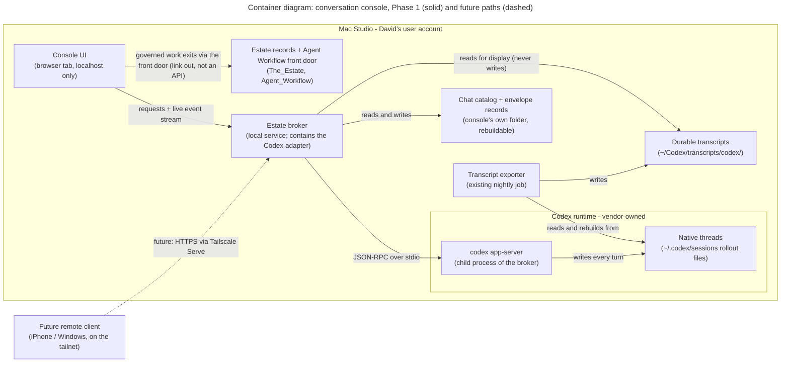

# The estate-owned conversation console — Phase-1 design (Codex first)

**Working paper — design pass only. Nothing in this document is built, installed, or configured.**
Prepared 2026-09-01 for David, under ACI-260048 (governing action item), routed as OI-000155 /
Agent Workflow task 163. Author: Claude (Fable 5), headless design session on the Mac Studio.
Delivery home after review: `~/Documents/Projects/cowork-evolution/Design/`.

---

## 0. The recommendation, up front

**Build the Phase-1 console as a local web application in a browser tab, backed by one
estate-owned broker service running on the Mac, and have that broker start Codex's supported
`app-server` interface as its own child process, talking to it over stdio.** Store almost
nothing: one small rebuildable catalog database for the chat list, plus one tiny append-only
"envelope" file per chat recording what was requested at launch. Everything else — the
conversation itself — already has two homes that exist today: Codex's own native thread files,
and the deterministic transcript exporter that already runs nightly on this machine.

In plain English, the moving parts and who owns them:

- **The console UI** is a web page David opens in a browser tab on the Mac (address
  `http://localhost:…` — "localhost" means the page is served only to this machine; nothing is
  on the network). It shows the chat list, the live conversation, and approval buttons.
- **The broker** is one small estate-owned program that sits between the UI and Codex. It is
  the only thing that talks to the runtime. It owns the chat catalog, enforces estate policy
  (what gets displayed, what gets warned about), and later becomes the single door a remote
  device knocks on. "Broker" here means exactly that: a middleman that speaks both languages
  and lets neither side touch the other directly.
- **Codex's app-server** is OpenAI's supported programmatic interface to Codex — the same
  engine as the terminal, exposed as structured commands (start a thread, send a message,
  stream the reply, ask for approval) instead of a screen of text. The broker starts it as a
  child process and talks to it over **stdio** (standard input/output — a private pipe between
  two programs on the same machine, with no network socket at all).

Why this shape and not the alternatives (full comparison in §10): a native Mac application
would have to be thrown away when the remote phase arrives, because an iPhone cannot run it —
the web UI, by contrast, is *already* the remote client, just not yet exposed; and a
stdio child process is the simplest possible trust boundary — when the broker stops, the
runtime interface stops with it, and there is never an open socket for anything else to find.

The two choices the record left open are answered here and marked for David's ruling:

- **Interface technology and broker shape** — local web app + estate broker + stdio child
  process. `[DECISION REQUIRED — D1, §10]`
- **What derived data to store** — a rebuildable SQLite catalog (SQLite is a single-file
  database, no server involved) plus per-chat envelope files; nothing else. Everything in the
  catalog can be deleted and rebuilt from the runtime and the transcripts.
  `[DECISION REQUIRED — D2, §10]`

Everything else in this paper explains what talks to what, who decides at each moment, and
what can go wrong — and closes with the decisions David must make before any build is
authorized.

---

## 1. Architecture and trust boundaries

**What a "trust boundary" is:** a line on the diagram where the rules change — where one
component must stop assuming and start verifying, because the thing on the other side is owned
by someone else (a vendor, a different agent, a different machine).

*Legend: every box is a real component with its real name and location; solid arrows are
Phase 1; the dashed arrow is the future remote path (§8), not built in Phase 1. The outer box
is the Mac; the inner "Codex runtime" box is the vendor-owned territory inside it. JSON-RPC is
a standard format for structured program-to-program requests and replies.*

**Walkthrough of the main path.** David types in the browser tab. The UI sends his message to
the broker; the broker's Codex adapter (§7) translates it and forwards it to the app-server
as a structured request; Codex thinks and
streams back events (text as it is written, commands it wants to run, approval requests); the
broker relays those to the UI as a live stream. Codex itself writes every turn into its native
thread files on disk as it goes. Later — tonight, on the existing schedule — the transcript
exporter rebuilds the durable, scrubbed, human-readable transcript from those files. The
console's own catalog only remembers *which chats exist and how they were configured*, and can
be rebuilt from scratch.

**Who decides, at each boundary:**

- **UI ↔ broker:** the broker decides. The UI is display and input only; it holds no
  authority and no durable state. (This is what makes the future remote client safe to add —
  it will be another UI, with nothing to steal.)
- **Broker ↔ app-server:** Codex decides what it will actually do; the broker decides what
  gets asked and what gets shown. The broker never reaches around the app-server into Codex's
  files to *write* anything — the supported interface is the only write path into a thread.
- **Runtime ↔ estate:** existing governance decides. Nothing in this console authorizes
  work; governed work exits through the Agent Workflow front door exactly as it does today
  (§5, §9).
- **Mac ↔ future remote:** the broker decides, later, under §8's rules. In Phase 1 this
  boundary simply does not exist: nothing listens on any network address.

**What can go wrong at each boundary (summary — details in the sections named):**

- Broker crashes mid-conversation → the child app-server dies with it; recovery is §3's
  contract (nothing is lost that Codex had written; the in-flight turn is marked interrupted).
- A message is sent but never confirmed → the duplicate-prevention rule in §3 stops it being
  silently sent twice.
- The console's catalog is corrupted or wrong → it is rebuildable by design; §3 defines the
  rebuild.
- Approval fatigue blurs runtime prompts into estate authorization → §5 keeps them visually
  and semantically separate.
- Two chats work the same folder at once → §6's collision warning.
- A future runtime lacks a control this UI shows → §7's gap table forbids faking it.

---

## 2. The Phase-1 user journey, and the screen/state inventory

**The journey.** David opens the console tab and sees his chat list — active chats first, with
a one-line status each. He clicks **New chat**, and a small form offers: a topic/title, a
working folder, a model (from the live list Codex reports, with the reasoning-effort choices
each model supports), a primary role and optional role lenses, and a posture — **research**,
**recommend**, or **act**. He submits; the chat opens; the envelope he chose is pinned at the
top and stays visible. He types; the reply streams in live, including a running view of any
commands Codex runs. When Codex wants to do something the runtime's rules gate — run a
particular command, edit a file — an approval card appears in the conversation; David clicks
approve or decline and the chat continues without dropping. He starts a second chat on a
different topic; both run independently. He closes the tab, or the Mac reboots; when he comes
back, the chat list shows both chats with an honest state ("interrupted mid-reply" or "idle"),
and clicking one resumes it. When a topic is finished he archives it; it leaves the active
list but its transcript remains readable forever.

**Screen/state inventory** (one row per state a chat can be in; "screen" is what David sees):

| State | What David sees | What he can do | What the system is doing |
|---|---|---|---|
| **Create** | New-chat form: title, folder, model + effort (discovered live), role(s), posture | Fill and submit, or cancel | Broker calls model discovery, validates the folder, writes the envelope record, starts the thread |
| **Active / streaming** | Text streaming in; command activity shown as it runs; envelope pinned | Type the next message; interrupt the turn | Broker relays the event stream; Codex writes the native thread |
| **Approval / input required** | An approval card (what is being asked, by which chat, in which folder) or an input request | Approve / decline / answer | Turn is paused inside the runtime awaiting the reply; nothing else is blocked |
| **Interrupted / reconnecting** | Banner: "this chat was interrupted; last confirmed activity at …" | Resume (continue typing), or leave it | Broker has restarted or the runtime went away; §3's recovery contract runs |
| **Completed / idle** | Full conversation, quiet; turn-complete marker | Continue, archive, or leave | Nothing; idle chats consume no provider allowance (§6) |
| **Resume** | The chat as it was, rebuilt from the native thread | Continue the conversation | Broker resumes the thread through the supported interface |
| **Archived** | Read-only conversation in the archive list | Read; unarchive; follow the link to the durable transcript | No live thread; the transcript is the record |

Deliberately **not** screens in Phase 1: any dashboard view (§9 reserves the seam), any
settings editor for runtime configuration (the console displays configuration; it does not
manage it), and any remote anything (§8).

---

## 3. The source-of-truth and recovery contract

This is one of the two load-bearing sections. It answers, precisely: *at every moment, which
copy of the conversation is the real one?* — and what happens on every failure the design must
survive. Three layers hold conversation-related data. **The rule of the whole design is that
each layer is canonical for exactly one thing, and no layer ever silently substitutes for
another.**

### 3.1 The three layers

1. **The native thread** — Codex's own on-disk record of the session, written by the runtime
   itself, turn by turn, as it works (on this machine: rollout files under
   `~/.codex/sessions/`, plus the runtime's own indexes). *Canonical for:* the live
   conversational state — what the model actually said and did, and the context needed to
   resume. Owned by the vendor's code; the console never writes it directly.
2. **The deterministic exported transcript** — the durable, human-readable record rebuilt
   mechanically from the native thread. **This machinery already exists and runs on this Mac**
   (verified live this session): `export-codex-transcripts.py` in the nightly chain rebuilds
   `~/Codex/transcripts/codex/<session-id>.md` from the rollout files, inheriting the estate's
   established transcript rules — secret scrubbing, ownership modes, and a stated
   source-preference rule (see 3.3). *Canonical for:* the durable conversation, audit, and
   recovery record — what the estate keeps after the runtime's own files age out.
3. **The console's derived data** — the chat catalog (list of chats, titles, states, thread
   IDs, transcript pointers) and one small append-only **envelope record** per chat (what was
   requested at launch — §4). *Canonical for:* only the envelope record — the one fact nothing
   else records, namely what the console asked for. The catalog itself is canonical for
   **nothing**: it is a rebuildable index, and the design treats "delete the catalog and
   rebuild it" as a routine operation, not a disaster.

### 3.2 Which copy is the real one, moment by moment

| Moment | Canonical for reading back | Canonical for resuming | Notes |
|---|---|---|---|
| During a live turn | The event stream (ephemeral display) | The native thread | The UI's scrollback is a rendering, never a record |
| Turn complete, before export | The native thread | The native thread | The transcript does not exist yet for today's turns; that is normal |
| After the nightly export | The exported transcript | The native thread | Two records, two jobs: transcript = read/audit; native thread = live context |
| Native thread aged out or deleted | The exported transcript — the *only* record | **Nothing** — resume is honestly impossible | The chat becomes read-only; the UI must say so rather than pretend |
| Catalog lost or wrong | Unaffected | Unaffected | Rebuild per 3.6; envelope records are files, not catalog rows |

One consequence to say out loud: **on the day a chat happens, the durable transcript lags the
conversation by up to one nightly cycle.** That is the existing, deliberate estate pattern
(the same one that governs Claude Code transcripts). If David wants a tighter bound, the
correct fix is an on-demand "export now" trigger that runs the *same* deterministic exporter —
never a second, parallel transcript writer. Recorded as decision D5 (§10).

### 3.3 Duplicate-message prevention

Two distinct duplication risks, two distinct mechanisms:

- **In the transcript (already solved, verified this session):** a single human message
  appears *twice* inside a native rollout file — once as the human-visible event, once inside
  the raw model-input record alongside injected harness preamble. The existing exporter
  documents and enforces a source-preference rule: each event class has exactly one preferred
  source, so each message renders exactly once and injected preamble never leaks into the
  durable record. The console inherits this by using that exporter, which is a reason in
  itself not to build a new one.
- **In the live thread (the console's job):** the dangerous window is between David pressing
  send and the runtime durably recording the message — if the broker crashes inside that
  window, did the message arrive? The contract: the broker stamps every outbound message with
  its own client-generated ID and records it as *sent-unconfirmed* until the runtime's event
  stream acknowledges the turn. On restart, for any sent-unconfirmed message, the broker reads
  the thread back through the supported interface and checks whether the message is in the
  recorded history. If it is: mark confirmed, done. If it is not: **never auto-resend.** The
  UI shows "this message may not have been delivered" with the text preserved for David to
  resend with one click. Automatic resend is how a system double-instructs an agent; a human
  resend costs one click and is always safe.

### 3.4 Partial or interrupted export

The existing exporter is a *full rebuild per session*: each run reconstructs the whole
transcript from the rollout, so a half-written export self-heals on the next run rather than
accumulating damage. Two build-time requirements to carry into the increment that touches
this: (a) confirm the write is atomic (write to a temporary file, then rename — so a reader
never sees a half-file); (b) the console must treat a transcript file as advisory display
material and route "is this complete?" questions to the native thread while it still exists.
*(Atomicity of the current exporter's write was not verified this session — checking it is
part of increment I1's work, not an assumption.)*

### 3.5 Application restart and Mac reboot

- **Broker restart (crash or upgrade):** the child app-server dies with it — by design; that
  is the trust boundary working. Nothing already written to the native thread is lost, because
  the runtime writes turn by turn. On start, the broker: reads its catalog; asks the runtime
  for the live thread list and reconciles (threads it didn't know → add; threads that are gone
  → mark accordingly); resumes chats marked active; runs the 3.3 sent-unconfirmed check; and
  marks any chat whose turn was in flight as **interrupted**, showing the last confirmed
  activity. A turn interrupted mid-stream is honestly lost from "in-progress" back to its last
  recorded item — the UI says so and lets David continue from there.
- **Mac reboot:** identical, plus the question of who starts the broker. Phase-1
  recommendation: David starts it manually (or by login item) — *not* a system daemon — so the
  prototype adds no service-management surface. Promoting it to managed service territory is a
  later, separate authorization, and belongs beside — not inside — the Alfred daemon work
  (ACI-260009 owns that pattern). Recorded as decision D4 (§10).
- **What is deliberately *not* promised:** mid-turn survival. If the machine dies mid-reply,
  the reply is cut at the last recorded item. The design optimizes for honest, boring recovery
  over heroic resumption.

### 3.6 The rebuild contract (the catalog's insurance policy)

At any time, the whole catalog can be rebuilt from sources that outrank it: the runtime's
thread list (IDs, working directories, archived status), the envelope record files (launch
configuration, titles), and the transcript store (pointers, read-only entries for chats whose
native thread is gone). The build must ship a "rebuild index" command and the acceptance test
for increment I3 exercises it. Anything that cannot be rebuilt this way is, by definition, not
allowed to live only in the catalog.

---

## 4. The launch envelope: what a chat is configured as, and how David audits it

The **envelope** is the set of choices that define a chat at birth: working folder, model,
reasoning effort, primary role, optional role lenses, and posture (research / recommend /
act). Three principles:

1. **Discovered, not hard-coded.** The model list and each model's supported effort levels
   come from the runtime's own discovery call at chat-creation time, so the form can never
   offer a model that does not exist. (Verified this session against the app-server protocol
   documentation: model discovery reports models with their supported reasoning efforts and a
   default flag.) The working folder is validated against the real filesystem. Role packages
   are read from their canonical estate homes.
2. **Requested versus applied are two different facts, and both are kept.** What the console
   *requested* is written, verbatim and append-only, to the chat's envelope record — including
   the full text of any injected role or posture instructions. What the runtime *actually
   applied* is recorded by the runtime itself in the native thread (each turn's context
   records the model, working directory, and sandbox policy in force — this is in the rollout
   format the existing exporter already parses). The UI's envelope panel shows both, side by
   side, and highlights any mismatch. David's audit path after the fact: open the chat →
   envelope panel; or read the exported transcript, where the same turn-context facts survive
   durably.
3. **Injected instructions refine; they never mint identity or authority.** Choosing the
   "Analyst" lens or the "act" posture injects or references instruction text — recorded where
   David can read it — but it does not create a new agent, override any standing rule, or
   constitute permission. The posture is made *enforceable*, not by the injected prose, but by
   the runtime controls the broker sets with it: a research-posture chat is launched under the
   runtime's read-only sandbox mode; an act-posture chat under a workspace-write mode with
   approvals on. (Codex's configuration surface for this — sandbox modes and approval policies
   — was verified this session against the vendor's configuration reference.) The mapping of
   posture → sandbox/approval defaults is decision D3 (§10).

---

## 5. Native runtime approvals versus estate-level authorization

Two different systems answer two different questions, and the console must show both without
ever letting one impersonate the other.

- **Native runtime approvals** answer: *"may this process do this mechanical thing right
  now?"* Codex's app-server sends the client explicit approval requests — for command
  execution, for file changes, for permission grants — and the console renders each as an
  approval card David answers. These are the runtime's own safety gates, scoped to one command
  or one edit in one chat. (Operation names verified this session against the app-server
  documentation.)
- **Estate-level authorization** answers: *"may this work happen at all?"* That authority
  lives where it always has: David's rulings, the action-item and decision registries, and the
  Agent Workflow front door. **Chat is not authorization** — a conversation that concludes
  "work is needed" produces an intake through the front door, exactly per the standing
  two-lane rule (ACI-260025: exchanges inform, the gate releases). The console gives that exit
  a visible affordance — "hand this to the front door" prepares an intake for David to review
  and file — but the console itself never becomes a second workflow authority (ACI-260048
  non-goal, honored here).

Design consequences: approval cards and estate-authorization affordances get visibly different
treatments (different color *and* different shape and wording, so the distinction survives
color-blindness and habit); clicking "approve" on a sandbox prompt is never recorded as
anything more than what it is; and no accumulation of native approvals ever upgrades a chat's
posture — posture changes are a new envelope, visible in the audit trail.

---

## 6. Safe concurrency: four separate limits that must not be confused

"Can I run several chats at once?" is really four different questions with four different
answers, plus one physical footnote. Conflating them is how systems end up either
over-restricted (one chat at a time "to be safe") or under-restricted (two agents editing the
same file). The console treats each limit with its own mechanism:

1. **Independent session ownership.** Each chat is its own thread with its own history and its
   own working folder. Threads do not share context; a second chat is a genuinely new session,
   not a tab into the first. The broker multiplexes many threads over one app-server child —
   so *N* chats do not mean *N* runtime processes. Mechanism: none needed beyond the design;
   this is the default the protocol gives us.
2. **Filesystem and shared-document collisions.** Two chats can be perfectly independent as
   sessions and still both write `~/Documents/Projects/X/plan.md`. Mechanism in Phase 1: a
   **warning, not a lock** — at chat creation and at posture display, the console flags when
   an act-posture chat's working folder overlaps another active act-posture chat's folder.
   Hard leases over shared documents are an estate-wide concern (the standing-operations work,
   ACI-260047, owns that thinking) and must not be invented ad hoc inside this console.
3. **Provider allowance.** Codex usage on ChatGPT plans draws on a shared rolling five-hour
   window (local and cloud usage together), with additional weekly limits; consumption varies
   with model, context size, reasoning and tool use — it is a *throughput* budget. (Verified
   this session against the vendor's pricing documentation.) Two consequences the UI should
   reflect: **idle open chats cost nothing** — there is no reason to close chats for
   allowance's sake; and heavy chats on big models drain the same shared window David's other
   Codex work uses. Mechanism: display and honesty (show which chats are actively consuming),
   not enforcement — the provider enforces its own limits.
4. **Runtime concurrency.** Codex has a configurable cap on concurrent *spawned-agent threads
   within one session* (`agents.max_concurrent_threads_per_session` — verified this session
   in the vendor's configuration reference). That is a per-session sub-agent limit, **not** a
   plan-wide cap on how many top-level chats may exist. The console must not treat it as a
   chat-list limit, and must not assume any particular top-level cap without observing one.

*Physical footnote:* the Mac's own CPU, memory and disk are a fifth, real constraint — several
simultaneously *streaming* chats plus the rest of the estate's scheduled work share one
machine. Phase 1 needs no mechanism beyond not pretending this constraint doesn't exist; the
standing-operations capacity policy (ACI-260047) is where measured limits belong.

---

## 7. The smallest common adapter contract — and the honest gap table

This is the second load-bearing section. Its purpose is to stop Phase 1 baking Codex's shape
into the console. An **adapter** is the translation layer between the console's common
vocabulary and one runtime's native protocol; the console core speaks only the common
vocabulary and must keep working — degraded but honest — when an adapter cannot supply
something.

### 7.1 The smallest common contract

Eleven operations. If a capability is not needed by the §2 journey, it is not in the contract
(notably: forking a thread, goal budgets, and compaction are Codex features the *Codex
adapter* may use internally, but they are not common vocabulary).

| # | Operation | Plain English |
|---|---|---|
| C1 | `list_models()` | What models and effort levels can a new chat choose? (May return a fixed or single-entry list.) |
| C2 | `create_chat(envelope)` | Start a new session with the §4 envelope; returns a chat ID. |
| C3 | `send_message(chat, text, client_id)` | Deliver David's message; the client ID powers §3.3's duplicate prevention. |
| C4 | `event_stream(chat)` | One ordered stream per chat: text deltas, tool/command activity, approval requests, errors, turn-complete, session-closed. |
| C5 | `respond_approval(chat, request_id, decision)` | Answer an approval request without dropping the session. |
| C6 | `interrupt(chat)` | Stop the current turn. |
| C7 | `list_chats()` | Enumerate this runtime's sessions with IDs, folders, archived state. |
| C8 | `resume(chat)` | Reopen a prior session with its context. |
| C9 | `archive(chat)` / `unarchive(chat)` | Move a session out of / back into the active list. |
| C10 | `applied_envelope(chat)` | What configuration is actually in force (for §4's requested-vs-applied audit). |
| C11 | `transcript_pointer(chat)` | Where the durable exported transcript for this chat lives, if anywhere. |

Contract rules: every operation may return **`unsupported`**, and the console core must render
that as an absent or greyed control labeled "not supported by this runtime" — *simulating* an
unsupported control (e.g., faking "archive" by hiding a chat locally) is prohibited, because a
simulated control teaches David a false model of what the runtime is doing.

### 7.2 The mapping-and-gap table

Column one is the contract; the other three columns are the three intended runtimes. **Codex**
entries were verified this session (vendor app-server documentation, retrieved; local CLI
surface, inspected). **Claude Code** entries are grounded in the CLI installed on this Mac
(help surface inspected this session) — its programmatic-embedding surface was *not* verified
against vendor documentation this session and is marked accordingly. **Alfred/OpenClaw**
entries follow the estate's own records (ACI-260009, ALF-045), which themselves carry the
caveat that OpenClaw specifics must be verified against current OpenClaw documentation at
build time; treat every entry in that column as direction, not fact.

| Contract | Codex (Phase 1 — verified) | Claude Code (future) | Alfred / OpenClaw (future) |
|---|---|---|---|
| C1 list models | `model/list` with supported reasoning efforts and default flag | CLI has `--model` and `--effort <level>`; **no discovery call found** in the installed CLI help — adapter may need a maintained static list *(unverified whether the Agent SDK offers discovery)* | **No equivalent assumed.** Alfred's model is his own configuration; the adapter reports a single fixed entry. Offering a model picker for Alfred would be the console reaching inside his runtime — out of scope by design |
| C2 create chat + envelope | `thread/start`, then `turn/start` with model, effort, working directory, sandbox/approval policy | `claude -p` / `--bg` with `--model`, `--effort`, working directory, permission flags — session-per-invocation shape differs from a persistent server *(embedding surface unverified)* | A new Gateway conversation. **Working folder: NO equivalent** — the console never sets where Alfred works. **Sandbox/approval policy: NO equivalent at this boundary** — his safeguards are his own; the envelope reduces to topic + posture *as a request* |
| C3 send message | `turn/start` (and `turn/steer` to append to an in-flight turn) | Print-mode streaming input / SDK message send *(unverified)*; **mid-turn steering: no equivalent found** | Message over the authenticated Gateway channel *(shape unverified)* |
| C4 event stream | Rich typed notifications: item deltas, command output deltas, turn lifecycle, thread status | `--output-format stream-json` emits structured streaming events *(field-level mapping unverified)* | Whatever the Gateway/web-chat surface emits *(unverified)*; command-activity detail likely **not exposed** — and that is correct: his internals are not the console's to display |
| C5 approvals | `item/commandExecution/requestApproval`, `item/fileChange/requestApproval`, `item/permissions/requestApproval` → accept/decline | Interactive permission prompts exist; a wire-level approval callback for embedded use was **not verified** this session | **NO equivalent.** Alfred is autonomous within his own rules; he does not route per-command approvals to this console. The UI must not show an approvals affordance for him |
| C6 interrupt | `turn/interrupt` | Process-level stop for `--bg` sessions (`claude stop`) *(semantics unverified)* | **Unverified**; possibly a conversational "stop", not a protocol cancel |
| C7 list chats | `thread/list` (filters: archived, working directory) | Session files exist locally and `--resume` presents a picker; a programmatic list call was **not verified** | Gateway session list *(unverified)*; scope: only conversations *with David via this console*, never his other activity |
| C8 resume | `thread/resume` | `--resume <id>` / `--continue`; `--fork-session` exists (richer than the contract needs) | **Unverified**; his continuity is his own memory — "resume" may mean merely "reopen the channel," and the adapter must say which it is |
| C9 archive | `thread/archive` / `thread/unarchive` (also CLI verbs) | **NO equivalent found** in the installed CLI help. Adapter would return `unsupported`, or archive only console-side with explicit "hidden here, not in the runtime" labeling — the honest form of a local-only action | **NO equivalent assumed** |
| C10 applied envelope | Turn-context records in the thread (model, cwd, sandbox policy per turn) + `thread/read` | Partial: session metadata exists in session files *(programmatic access unverified)* | Minimal: the adapter can attest the channel and identity used, **not** his internal configuration |
| C11 transcript pointer | `~/Codex/transcripts/codex/<id>.md` via the existing nightly exporter (live machinery, verified) | `~/Claude/transcripts/code/<id>.md` via the existing Claude-side exporter (live machinery per the estate bootstrap) | **NO equivalent permitted.** His transcripts live inside his boundary. The pointer is `none`, by policy, not by gap — see 7.3 |

Reading the table honestly: Codex is the only column where the contract is fully satisfiable
today, which is exactly why Phase 1 is Codex-only. The Claude column is *probably* mostly
satisfiable via its SDK/print surfaces but must be re-verified against vendor documentation
when its adapter is authorized. The Alfred column is the one that bends the contract — several
`unsupported` entries are **by policy rather than by technical gap**, and the UI treating
"unsupported" as a first-class, labeled state is what lets one console honestly host all
three.

### 7.3 Alfred's boundary — a hard requirement, stated plainly

- **What may exist outside Alfred's user boundary:** routing and display metadata only — a
  chat entry (ID, David's title, timestamps, state), the Gateway endpoint *reference* (never
  credentials), and the console's own envelope record of what was requested. This is the
  "minimum display material" the governing record allows, and this design adds nothing to it.
- **What may not:** message content at rest, transcripts, memory files, or anything derived
  from his memory. In Phase-1-shaped terms: when an Alfred adapter someday exists, his
  conversation text is rendered from the live stream and **not persisted** by the console;
  the chat catalog holds his chats' *existence*, not their words. If David someday wants
  console-side retention of Alfred conversations, that is a new decision with a new record —
  **no replication of Alfred's private memory into Cowork/Codex-readable storage is assumed
  anywhere in this design.**
- **Remote use of Alfred is a separate security decision.** Alfred is the health-data-capable
  agent. This paper's remote section (§8) is designed and justified for the NON-PHI Codex
  prototype only; nothing here establishes, implies, or pre-approves reaching Alfred from a
  remote device. That question has its own owners (ACI-260009's daemon/boundary work and the
  estate's HIPAA go-live checkpoint) and must be ruled on its own evidence.

---

## 8. The future remote shape — designed now, built later, none of it in Phase 1

**Nothing in this section is Phase-1 scope.** It exists so Phase-1 choices don't foreclose it
— which is also why the recommendation in §0 is a web UI behind a broker.

- **The path:** Tailscale Serve. A **tailnet** is David's private Tailscale network — only his
  own signed-in devices are on it. **Serve** publishes a service running on the Mac to that
  tailnet only (unlike Funnel, which is public and is explicitly not wanted here), proxying to
  a localhost port and handling HTTPS certificates automatically. Verified this session
  against Tailscale's documentation, including one property this design leans on: Serve adds
  identity headers (who on the tailnet is making the request) to proxied requests, and the
  backend should listen only on localhost so those headers can't be spoofed — which is
  precisely the broker's Phase-1 posture already.
- **Live status note (read-only check this session):** the Mac currently has no Serve
  configuration active. The estate record ALF-045 (2026-05-20) recorded that Serve was not yet
  enabled at the *tailnet* level — an account setting only David can change; whether that has
  changed since could not be determined from a read-only check. Enabling it is a named David
  action in ALF-045 and remains a prerequisite for this future phase.
- **Application interface:** the remote client is the *same web application*, served through
  Serve, talking to the *same broker API*. The design rule from the governing record holds: a
  remote client talks to the estate-owned broker, never directly to a runtime socket — the
  Codex app-server's own WebSocket transport is documented by the vendor as experimental and
  unsupported for production, and this design never exposes it regardless.
- **Event stream and reconnect:** every per-chat event carries a monotonically increasing
  sequence number; a reconnecting client presents its last-seen number and the broker replays
  from its bounded in-memory buffer or instructs a full state refresh. Phones sleep and
  networks drop; reconnection is the normal case, not the exception.
- **Device/session authentication and revocation — defense in depth, even inside the
  tailnet:** tailnet membership (layer 1, Tailscale's), the Serve identity header checked
  against an allowlist (layer 2), and the broker's own short-lived session tokens with a
  per-device grant list, idle timeout, and a revocation list David can act on from the Mac
  (layer 3). Being on the network is necessary but never sufficient.
- **Minimal remote persistence:** the device stores a session token and nothing else — no
  message cache, no transcripts, no offline copy. The Mac remains the sole execution and
  memory authority; the remote device is a window, and losing the phone must cost one
  revocation, not one apology.

---

## 9. The dashboard seam

The direction of record (CLD-00128, extended by ACI-260047's Operations view) is that
dashboards are **read-only projections of canonical estate files** — the action-item index,
the orchestrator index, the ledgers. The console's job is to *open* those views, never to
*feed* them:

- **The seam, in Phase 1:** one reserved event type in the broker→UI API — a navigation
  intent ("open the Project view for cowork-evolution", "focus Operations") — plus an inert
  "Views" affordance in the UI. That is the entire Phase-1 build: a named socket in the
  woodwork, costing nothing.
- **Later:** a conversation can raise that intent (David asks "show me the queue"; the chat
  emits navigate, the console opens the dashboard rendered from canonical files). The chat
  *navigates* the view; it never *writes* status. If a conversation concludes that status
  should change, that conclusion travels the same road as all governed work — the front door —
  and the dashboard sees it when the canonical files change.
- **The rule that keeps this clean:** chat text is never parsed into a status store, and the
  dashboard never cites a conversation as a source. Anything worth showing on a dashboard is
  worth recording canonically first.

---

## 10. Alternatives, decisions for David, and the build sequence

### 10.1 Implementation alternatives considered

**Alternative A — local web app + estate broker + stdio child app-server (RECOMMENDED).**
Described throughout. *Tradeoffs:* requires a browser tab rather than a Dock icon (a thin Mac
wrapper can be added cosmetically later); the broker is one more estate-owned program to
maintain — but it is also the policy point, the audit point, and the future remote door, so
its cost buys the architecture's key property. *Security:* nothing listens beyond localhost;
runtime interface lives and dies with the broker. *Failure risks:* broker crash interrupts all
chats at once (mitigated by §3.5's honest recovery); a localhost port is reachable by other
local processes — the broker requires a local session token even in Phase 1 (cheap, and it
becomes layer 3 of §8).

**Alternative B — native Mac application (Swift/SwiftUI) talking directly to the app-server.**
*For:* best desktop feel; no browser. *Against, decisive:* an iPhone or Windows device cannot
run it, so the remote phase would rebuild the UI from scratch *and* still need the broker this
alternative skipped; it adds a development stack the estate does not currently maintain; and
UI-into-runtime with no broker means estate policy (envelope records, duplicate prevention,
collision warnings) either moves into vendor-shaped client code or doesn't exist. Rejected for
Phase 1; a native *wrapper* around the web UI remains open cosmetics.

**Alternative C — build on Codex's own app-server daemon and remote-control machinery.**
The installed CLI already ships daemon management (bootstrap/start/stop, a control socket, a
proxy, and remote-control pairing). *For:* less broker code; turns could survive a console
crash because the daemon outlives it. *Against, decisive:* both surfaces are marked
experimental by the vendor; session brokering and pairing would live in vendor territory
outside estate policy; and the remote path would terminate at a runtime daemon rather than an
estate-owned broker — exactly what the settled direction prohibits. Rejected as the backbone.
Worth revisiting narrowly (daemon as the broker's *child-manager* only) if mid-turn survival
across broker restarts proves to matter in practice.

**Catalog alternatives (the second open question):** (i) **no store** — rebuild the chat list
from the runtime on every launch: rejected because envelopes, titles and posture have no
canonical home in the runtime, and the console would be leaning on vendor-side metadata
(vendor lock, and contrary to the portability §7 exists to protect); (ii) **SQLite index +
per-chat envelope files (RECOMMENDED)** — smallest store that satisfies §3.6's rebuild
contract; (iii) **full application database of record** — rejected outright: a second
canonical memory system is the one thing the settled direction forbids the app database to be.

### 10.2 Decisions required from David

Each is marked where it arises in the paper; recommendations restated here so the ruling can
be given per-line.

- **[DECISION REQUIRED] D1 — Interface technology and broker shape.** Recommended: local web
  app + estate broker + stdio child app-server (Alternative A). Alternatives B and C above,
  with reasons for rejection.
- **[DECISION REQUIRED] D2 — Derived store.** Recommended: rebuildable SQLite catalog +
  append-only per-chat envelope files, in a console-owned folder; "rebuild index" command
  mandatory. Alternatives (i) and (iii) rejected as above. Includes naming the folder's home.
- **[DECISION REQUIRED] D3 — Posture-to-enforcement mapping.** Recommended defaults: research
  → read-only sandbox; recommend → read-only sandbox with approvals for any write; act →
  workspace-write with approvals on. David rules the defaults and whether act-posture may ever
  relax approval prompts.
- **[DECISION REQUIRED] D4 — Broker start-up posture.** Recommended for Phase 1: manual/login
  start, no system daemon. Managed-service promotion is a later, separate authorization.
- **[DECISION REQUIRED] D5 — Transcript freshness and retention controls.** Recommended:
  accept the nightly export lag for Phase 1; add an "export now" button (same exporter) in a
  later increment if wanted. Also: archive is the normal end state; deletion of a native
  thread through the console is disabled in Phase 1 (delete exists in the runtime CLI; wiring
  it into a UI invites one-click destruction of a canonical-until-exported record).
- **[DECISION REQUIRED] D6 — Collision handling.** Recommended: warning-only in Phase 1;
  hard leases deferred to the estate-wide capacity/lease design (ACI-260047's territory).
- **[DECISION REQUIRED] D7 — Remote phase gate.** No remote work proceeds without a separate
  ruling; prerequisite named: Serve enablement on the tailnet (ALF-045, David-only action).
  Alfred-remote is excluded from any such ruling by default (§7.3).
- **[DECISION REQUIRED] D8 — Dashboard seam timing.** Recommended: reserve the navigation
  intent in Phase 1 (costless); build no view until the dashboard work itself (CLD-00128)
  delivers one to open.

### 10.3 Separately authorized build increments

Each increment is its own authorization with one testable acceptance criterion. None is
authorized by this paper.

- **I1 — Broker core + Codex adapter (no UI).** Scripted harness drives create → message →
  streamed reply → one approval round-trip → interrupt. *Acceptance:* the scripted
  conversation completes, and after the existing nightly exporter runs, the exchange appears
  once (no duplicates) in the chat's exported transcript.
- **I2 — Single-chat web UI + envelope audit.** *Acceptance:* David starts a chat from the
  browser, answers one approval card, and the envelope panel shows requested-vs-applied values
  that match the native thread's own turn-context records.
- **I3 — Multi-chat, resume, archive, rebuild.** *Acceptance:* two chats stream concurrently
  and independently; after a deliberate broker restart *and* a catalog deletion + rebuild,
  both chats reappear with correct state and no message is duplicated or lost.
- **I4 — Recovery hardening + concurrency surfaces.** *Acceptance:* with the broker killed
  mid-turn, restart marks the chat interrupted at its last confirmed item, the
  sent-unconfirmed banner behaves per §3.3, and an overlapping-folder act-posture chat
  triggers the collision warning.
- **I5 — Front-door handoff + dashboard seam stub.** *Acceptance:* "hand this to the front
  door" produces a correctly formed draft intake for David's review (filing remains his act),
  and the navigation intent event round-trips UI→broker→UI.
- **Future, each behind its own ruling:** remote over Tailscale Serve (D7); the Claude Code
  adapter (with its column of §7.2 re-verified first); the Alfred adapter (jointly gated on
  ACI-260009's daemon/boundary milestones and §7.3's rules).

### 10.4 Follow-up records this design suggests (proposed, not filed)

Per this task's fence, this session files nothing. If David adopts the direction: the Phase-1
build item (post-ruling, per ACI-260048's own next-actions) would be filed through the Agent
Workflow front door by Cowork or Codex; a small amendment noting the D5 deletion stance could
be recorded on ACI-260048 by whichever agent David directs; and the Serve-enablement
prerequisite already has its record (ALF-045) and needs no new one.

---

## Escalation note

No protected health information was encountered during this design pass; no credential,
token, or secret value was read or recorded (the existence of runtime authentication material
under the runtime's home directory is noted only as existence). Nothing required escalation.

## Fence statement

This paper is design only. It authorizes and performs **no** application or prototype code, no
service, daemon, or scheduled-job installation or change, no runtime or server launch, no
network exposure or tailnet/settings change of any kind, no account connection, and no change
to any estate file — the only artifact of this work is this document. Every capability
described here (including §4's "discovered from the runtime at launch") is a property of the
*proposed* application, to be built only under David's separate, per-increment authorization.

## Sources and verification

**Retrieved and read this session (public vendor documentation):**

- Codex app-server protocol documentation — https://learn.chatgpt.com/docs/app-server
  (also independently source-verified 2026-09-01 on ACI-260048). Basis for: operation and
  event names in §5/§7.2, transports, and the vendor's experimental-WebSocket caveat in §8.
- Tailscale Serve documentation — https://tailscale.com/docs/features/tailscale-serve
  (also on ACI-260048). Basis for: §8's Serve-vs-Funnel scope, TLS handling, localhost
  proxying, and identity headers.
- Codex pricing/usage documentation — https://learn.chatgpt.com/docs/pricing. Basis for §6
  limit 3 (shared five-hour window, weekly limits, consumption drivers).
- Codex configuration reference — https://learn.chatgpt.com/docs/config-file/config-reference.
  Basis for §4/§6: sandbox modes, approval policies, reasoning-effort values, and
  `agents.max_concurrent_threads_per_session` being per-session.

**Read on the live machine this session (read-only):** the installed Codex CLI
(v0.148.0-alpha.15) help surfaces for `app-server`, its daemon management, and
remote-control; the `~/.codex` session-storage layout; the existing
`export-codex-transcripts.py` (its documented source-preference and rebuild behavior — §3);
the populated `~/Codex/transcripts/codex/` store; the installed Claude Code CLI help surface
(§7.2's Claude column); and `tailscale serve status` (§8's live status note).

**Estate records read as evidence** (statements of what was true when written): ACI-260048
(governing), ACI-260025, ACI-260009, ACI-260047, ACI-260032, ALF-045, CLD-00043, CLD-00055,
CLD-00065, CLD-00109, CLD-00128.

**Marked unverified in place:** every entry so labeled in §7.2 (Claude Code's programmatic
embedding surface; all Alfred/OpenClaw specifics), the current tailnet-level Serve enablement
state (§8), and the atomicity of the existing exporter's file writes (§3.4). None of these is
load-bearing for the Phase-1 recommendation; each is named as build-time verification work.

