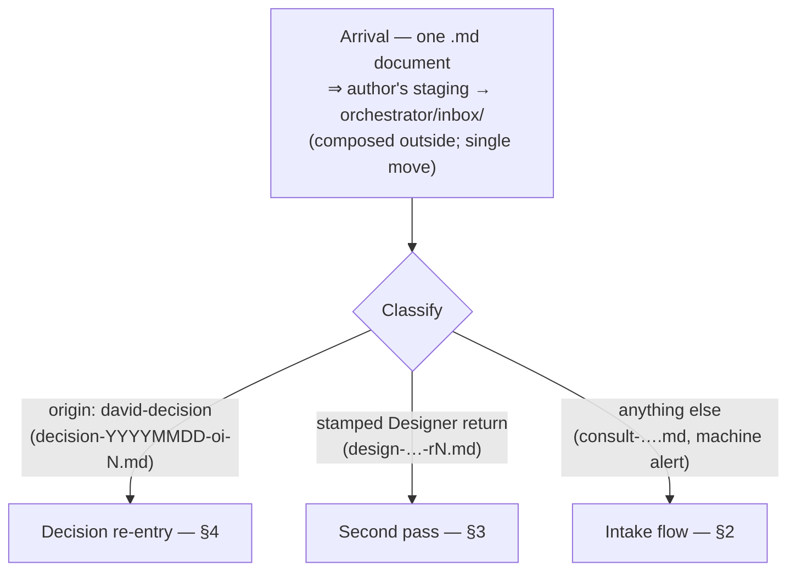
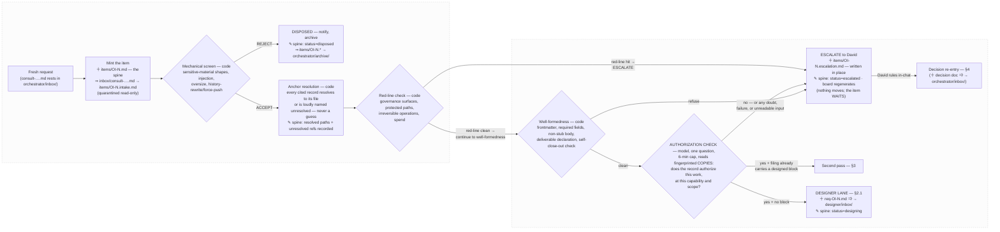
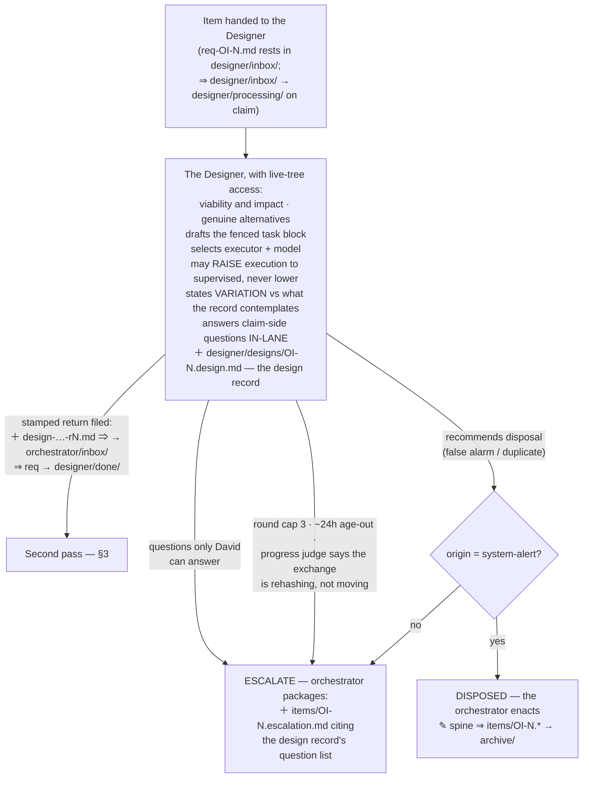
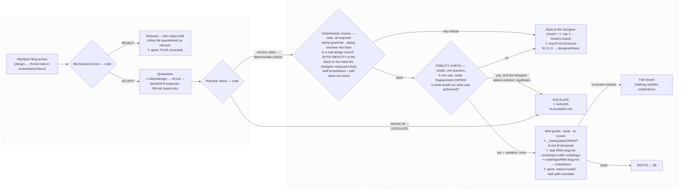
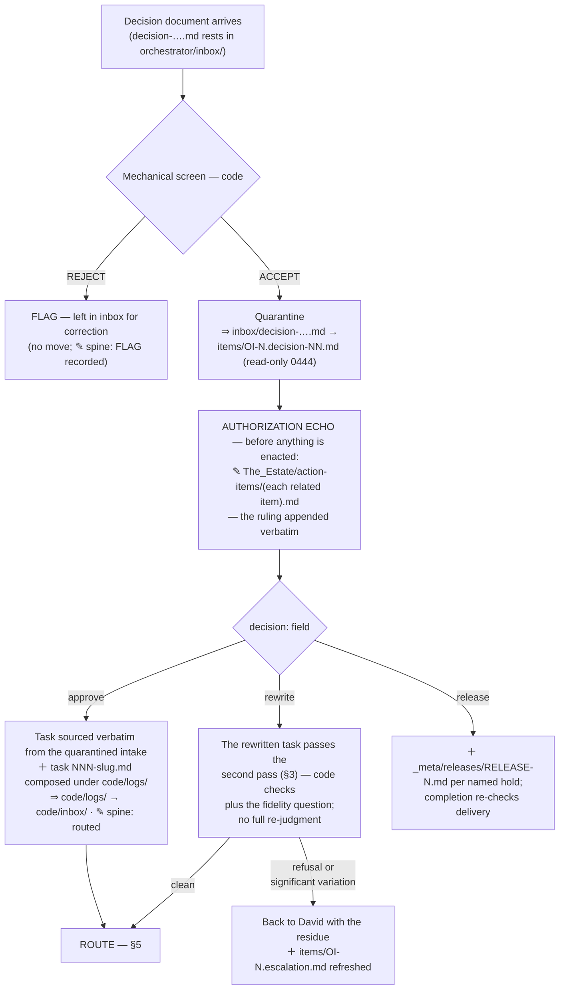
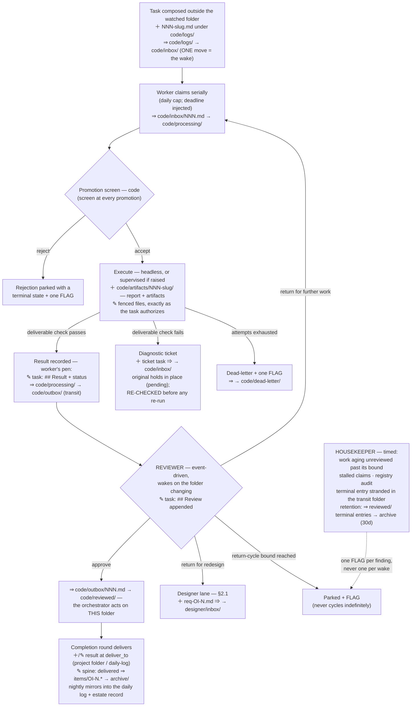

# The front door — designed end-state

**As designed through 2026-08-08.** Governing records: DEC-260114 (+ Amendments 1–2),
DEC-260119 (+ Amendment 1), the Verifier design of record, and the ratified
Reviewer/Housekeeper split (OI-000037 r4). This document describes the system those
decisions specify — one picture, present tense, no transition scaffolding. Diagrams are
Mermaid; Obsidian renders them in reading view.

**The design in one sentence:** code proves everything enumerable; exactly two short
single-question model checks guard authorization and fidelity; one lane — the Designer —
holds the pen for everything that requires judgment; every judging pass reads fingerprinted
copies, never the live records; and every path either routes, disposes within a named bound,
or waits on David's board forever — nothing expires, nothing is dropped.

---

## 1 · What arrives, and where it goes

| arrival | recognized by | enters |
|---|---|---|
| **Fresh request** | anything not matching the rows below | the intake flow (§2) |
| **David's decision** | `origin: david-decision` naming an open item | decision re-entry (§4) |
| **Designer return** | the Designer lane's stamped filing for an item it holds | the second pass (§3) |

### 1.1 · Handoff mechanics — how work actually moves

Four principles govern every transition on these maps:

1. **A piece of work IS a document, and custody IS the folder it rests in.** A handoff is an
   atomic move from one folder to another; the receiving lane notices because its folder is
   watched, so the move itself is the wake-up call. Two standing rules exist to protect this:
   *compose outside the folder, then one move* (arrival must be a single atomic event — no
   partially-written file is ever visible), and *no lane writes into a folder another lane
   watches* (a folder with two writers has ambiguous custody).
2. **Item state is the exception — it changes in place.** The item's spine
   (`orchestrator/items/OI-N.md`) never moves during its life; status transitions are edits
   to it, and only the orchestrator holds that pen. Sidecars (intake, responses, decisions,
   escalation packages) accumulate beside it, each made read-only on arrival. The whole set
   moves exactly once, to the archive, at the end.
3. **The handoff to David is the other exception.** Escalation moves nothing: a package is
   written in place, the item enters a waiting state, and he is notified (count-only). His
   return follows the normal rule — a decision document moved into the inbox.
4. **Terminal handoffs leave the tree.** Delivery writes results to their `deliver_to`
   destination (a project folder, the daily log), and the authorization echo appends rulings
   into the estate record. Everything between intake and delivery stays inside
   Agent_Workflow — which is why the pipeline's entire state survives crashes and is
   inspectable with a file listing: the filesystem is the queue.

**Map legend** — steps are annotated only where documents change; a check that merely reads
carries no annotation:

| symbol | meaning |
|---|---|
| **＋** | document created |
| **✎** | document modified in place |
| **⇒** | document moved — `source folder → destination folder` |

**Folder roster:** `orchestrator/inbox/` (the front door) · `orchestrator/items/` (spines +
read-only sidecars) · `orchestrator/archive/` (closed items) · `designer/inbox → processing
→ done` (the Designer's lane) · `designer/designs/` (design records) · `code/logs/`
(composition staging for tasks) · `code/inbox → processing → outbox(transit) → reviewed/`
(the executor's lane) · `code/artifacts/` (deliverables) · `code/dead-letter/` ·
`_meta/grants/` (capability grants) · per-call staging (judges' fingerprinted copies,
removed after each call) · exports: `deliver_to` destinations + `The_Estate/`.

---

## 2 · A fresh request

Four code checks, then one model question. The only general-purpose judgment at the front
door is the authorization check; everything else the front door does is provable by code.

### 2.1 · The Designer lane — where judgment lives

One lane holds the pen. It decides whether the work is viable and how it should be done,
drafts the executable task, and selects who runs it.

The lane is bounded three ways: a **round cap** (3), a **~24-hour age-out** per hold, and a
**progress judge** — a cheap single-question check that ends a rehashing exchange early
rather than letting it spend its rounds. All three exits land on David's board.

---

## 3 · The second pass — a filing that carries a design

Code proves the filing is what the Designer verified; one model question checks it serves
the intent. The session that wrote the verdict never held the pen; the session that held the
pen never writes the verdict.

**Auto-route without pinging David** requires all of: consultation origin, the
authorization check's yes, clean code checks, a designed block present, and the Designer's
stated `variation: none`. A significant variation always surfaces to him — "I've already
seen it; I don't want to see it again unless there is a significant variation."

---

## 4 · Decision re-entry — David's ruling comes back

---

## 5 · The executor lane — routing to closure

Review is **in the path**, not beside it: nothing reaches completion without having been
reviewed. Two jobs with different clocks own the lane's health — the **Reviewer** wakes on
events; the **Housekeeper** wakes on time, because events catch things that happen and
timers catch things that fail to happen.

Dependency resolution follows the work (a completed dependency counts wherever it rests);
task numbering never regresses across folder moves.

---

## 6 · How the judges read — copies, not originals

Every judging pass receives its record inputs as **fingerprinted copies in a per-call
staging directory** — the spine content, the quarantined sidecars, the resolved governance
anchors — and holds no path into the live estate, orchestrator, decisions, or transcript
trees. The fingerprints are recorded with the verdict, so what a judgment rested on is
reproducible. Three deliberate live reads, and only these: the byte-identity check hashes
the **real** filing that would route (a copy would prove the copy); the fidelity check reads
the **live** design record in the Designer's own tree; the Designer keeps live-tree code
access and write access to its own lane. The copier fails closed — an unreadable input
aborts the launch loudly rather than letting a pass judge on partial evidence. The write
guard watches the staging root; a pass that cannot reach the records needs no broad fence,
and a concurrent writer anywhere in the estate is invisible to it.

---

## 7 · Who decides what

| decision | owner |
|---|---|
| Is this filing safe and well-formed to look at? | **code** (screen, red-line, well-formedness) |
| Does the record authorize this, at this capability and scope? | **authorization check** (one model question) |
| Is this worth doing? Can it be done? How? Alternatives? | **Designer** |
| What questions block this, and are any David's? | **Designer** (only David-class questions leave the lane) |
| Which executor, which model, attended or not? | **Designer** (may raise to supervised, never lower) |
| Does it deviate from what the record contemplates? | **Designer states it**; a significant variation blocks auto-route |
| Is what would run what was authorized? | **code** (byte-identity) + **fidelity check** (one model question) |
| Is this alert a false alarm? | **Designer recommends; orchestrator enacts** — machine-raised alerts only |
| Did the finished work pass muster? | **Reviewer** (approve / return for work / return for redesign) |
| Is the lane healthy? | **Housekeeper** (timed; watches for what failed to happen) |
| Everything escalated | **David** — rules in-chat; the decision document is the enactment |

## 8 · Invariants — true on every path

- **Quarantine-first.** Every consumed arrival becomes an immutable sidecar before anything
  acts on it; only the orchestrator writes the item's spine.
- **Screen at every promotion.** Re-screened at every hop toward execution, whoever authored it.
- **Author ≠ checker.** The session that writes a verdict never held the pen, and vice versa.
- **Judges cannot touch the evidence.** Structurally — they read copies (§6).
- **Nothing routes on a guess.** An unresolvable cited record is a loud failure, never a
  fuzzy match.
- **Review precedes completion.** Nothing is delivered unreviewed.
- **Authorization echo.** A consumed ruling is written into the estate record before enactment.
- **Fail toward David, never toward silence.** Every doubt, cap, age-out, and refusal lands
  on the board and waits; escalations never expire; his answers arrive only through decision
  documents.
- **Every loop is bounded.** Adjudication retries, Designer rounds, review return-cycles,
  worker attempts, age-outs — a loop with no bound is a defect by definition.
