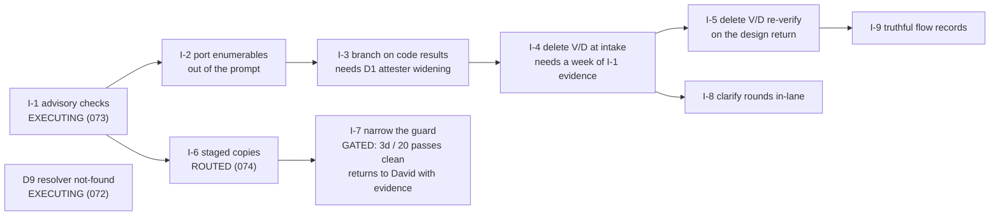
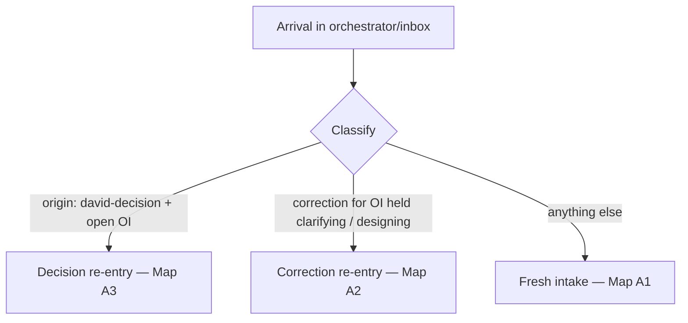
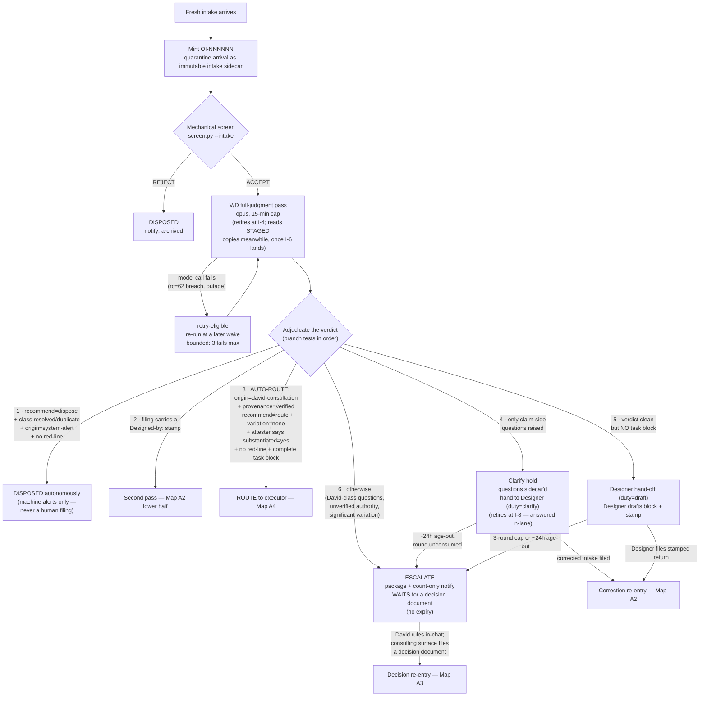
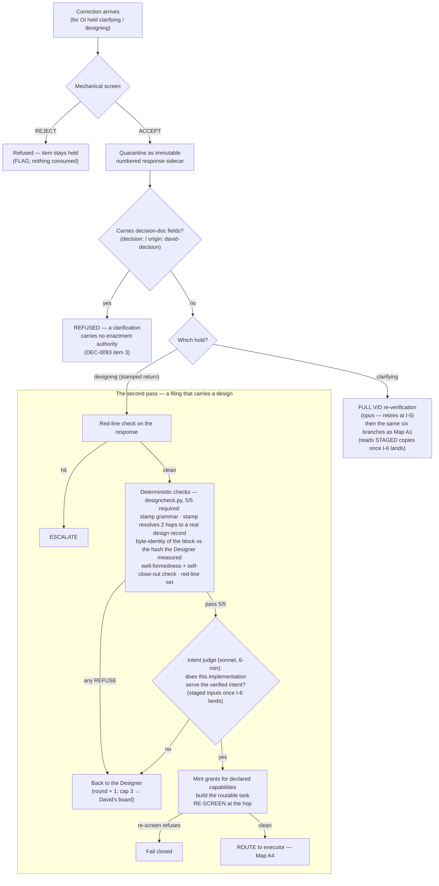
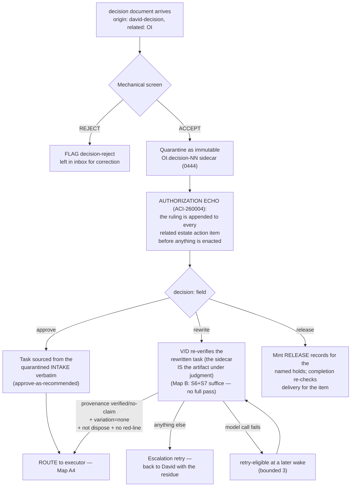
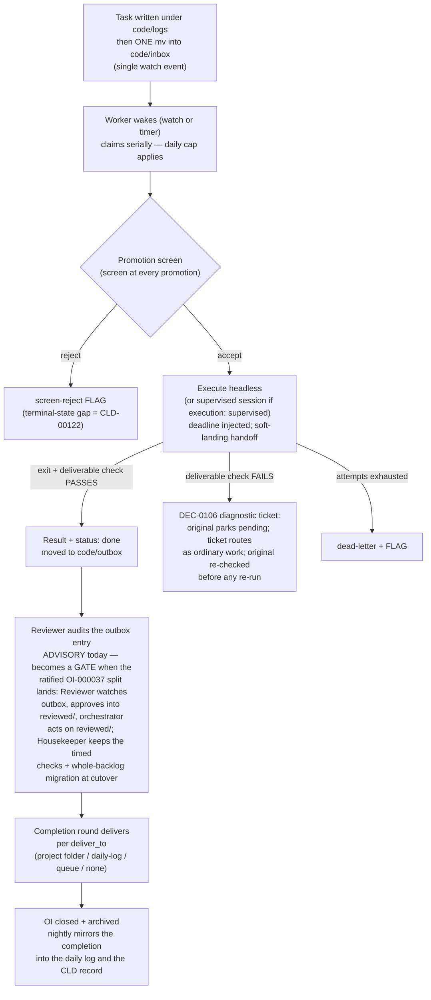
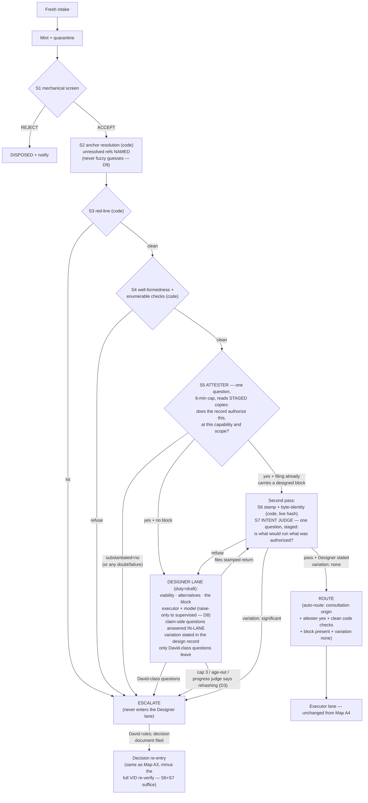

# Front-door routing map — the path of a new request, all routes accounted for

**Drawn 2026-08-08** (Code session `1b62176a`, David-requested). Sources: the live
`orchestrator/orchestrator.sh` as read this week, the Verifier design of record
(`verifier-rework-design-20260807.md` §1 and §5, whose code citations were verified against
the running tree), and DEC-260119 + Amendment 1. Diagrams are Mermaid — Obsidian renders
them natively in reading view.

**Two maps.** Map A is the system **as it runs today** — the one generating the current
notifications. Map B is the **ratified end-state** (DEC-260119) the increments are building
toward. Rows in the criteria tables cite the deciding rule.

> **This map goes stale by design:** each DEC-260119 increment that lands moves Map A toward
> Map B. Check the DEC's increment status before trusting Map A's V/D boxes.

---

## 0 · The transition, as underway (status 2026-08-08 ~10:40 PT)

The rework is not a future — three of its builds routed this morning. Where each piece
stands, and which Map A box it changes:

| build | what it changes on Map A | status |
|---|---|---|
| **I-1** advisory deterministic checks (task 073) | adds a code-check line beside the V/D box; routes on nothing — evidence-gathering | **routed, executing** |
| **I-6** staged copies, as amended (task 074) | every judge box reads copies, not live records; fingerprints land with verdicts | **routed, queued behind I-1** (fail-fast guard) |
| **D9** resolver says not-found (task 072) | S2/anchor box stops guessing; intakes citing nonexistent records hard-fail at the screen | **routed, executing** — the auth-echo's own "resolves to NO record" FLAGs this morning are the live demonstration of the gap it closes |
| **I-2→I-5** slimming (prompt port, code-driven branching, delete V/D at intake and on the design return) | the 15-min V/D boxes shrink, then disappear | pending — I-3 needs the D1 attester-widening; I-4 needs a week of I-1 evidence |
| **I-7** guard narrowing | breach refusals on concurrent writers end | gated on D4 evidence: **3 days or 20 staged passes, whichever later, zero judge-caused breaches** — returns to David with numbers |
| **I-8** clarify rounds move in-lane | the clarify-hold box disappears; Designer answers claim-side in-lane | pending, needs I-4 |
| **I-9** flow-record truthfulness | design rounds stop being logged as "clarification round 0" | pending, needs I-5 |
| **Reviewer/Housekeeper split** (OI-000037, ratified r4) | Map A4's reviewer becomes a GATE: outbox → reviewed/ → completion; two jobs, separate clocks | decision consumed; re-verification retrying after a breach-window bounce |
| **Spawn-exclusion, option (b)** (OI-000038, task 070) | not a front-door change — governs which SESSIONS the nightly narrates | **delivered + closed 10:36 today** |

---

## 1 · What can arrive in the inbox

Every arrival in `orchestrator/inbox/*.md` is classified into exactly one of three classes
at the next wake:

| class | recognized by | examples |
|---|---|---|
| **Fresh intake** | anything not matching the two classes below | a consultation filing from this chat (`consult-YYYYMMDD-…`); a machine-raised alert (`origin: system-alert`); a Librarian/machine requester filing |
| **Decision re-entry** | `origin: david-decision` naming an open OI in `related:` | `decision-YYYYMMDD-oi-NNNNNN.md` — David's ruling, filed by the consulting surface |
| **Correction re-entry** | `requested_by: cowork` (or the Designer's return filing) for an OI currently held `clarifying` or `designing` | a corrected intake answering a clarify round; the Designer's drafted return (`design-…-rN.md`) |

---

## 2 · Map A1 — a FRESH intake, today

**Bounds on this map:** V/D failures retry at later wakes, 3 max, then escalate. Clarify and
design holds age out at ~24 h (per round) into the normal escalation path. Design rounds cap
at 3, then park on David's board. An escalated item **never expires** — it waits for a
decision document ("the decisions sit and wait for you").

---

## 3 · Map A2 — CORRECTION re-entry, and the second pass

The top half is how a corrected intake or Designer return is received; the bottom half (the
second pass) is also entered from Map A1 branch 2 when a fresh filing already carries a
stamp.

---

## 4 · Map A3 — DECISION re-entry (David's ruling comes back)

---

## 5 · Map A4 — after routing: the executor lane to closure

---

## 6 · Map B — the ratified end-state (DEC-260119, as amended)

What changes: the 15-minute five-question V/D pass is gone. Code proves everything
enumerable; **two** short single-question judges remain; every judgment about worth,
feasibility, drafting, and executor choice lives in the Designer lane; judging passes read
**staged copies** of the records, not the live trees.

**Dispose in Map B (D2):** the Designer recommends disposal; the orchestrator enacts it
**only** for `origin=system-alert` — same authority bound as today, different opinion-former.

---

## 7 · Criteria quick-reference

| route | criteria (all must hold) | where ruled |
|---|---|---|
| Autonomous dispose | machine-raised alert (`system-alert`) + already-resolved/duplicate + no red-line | today: V/D verdict; Map B: Designer opinion (DEC-260119 D2) |
| Auto-route (no David ping) | consultation origin + verified authority + no deviation from the record + attester yes + no red-line + complete block | "if there is a CLD/DEC I've already seen it; I don't want to see it again unless there is a significant variation" (David); DEC-260119 D1 moves the variation statement to the Designer |
| Designer hand-off | authority verified but no executable block (high-level filing) — the DEC-260114 no-block-no-stamp path | DEC-260114 Amendment 1 |
| Clarify hold (Map A only) | only claim-side questions — answerable from the record without new authority | DEC-0093; retires at I-8 (claim-side questions answered in-lane) |
| Escalate to David | anything needing his authority: unverified/absent anchors, significant variation, interview/consultation-class questions, red-line hits, caps and age-outs | DEC-0099 (the consulting surface is the decision channel; Telegram is count-only) |
| Route to supervised session | `execution: supervised` on the routed task; the Designer may RAISE headless→supervised, never lower | DEC-260119 D8 |

## 8 · The invariants that hold on every path

- **Quarantine-first:** every consumed arrival becomes an immutable sidecar before anything
  acts on it; the spine is the orchestrator's record and only the orchestrator writes it.
- **Screen at every promotion:** a task is re-screened at every hop that moves it toward
  execution, regardless of who authored it.
- **Author ≠ checker:** the session that writes a verdict never held the pen; the session
  that held the pen never writes the verdict (DEC-260114 Amendment 1 item 3).
- **Authorization echo:** the moment a decision document is consumed, its ruling is appended
  to the related estate records — before enactment, independent of routing success.
- **Fail toward David, never toward silence:** any doubt, failure, cap, or age-out lands the
  item on the board as an escalation that waits indefinitely; nothing is dropped.
- **Bounded loops everywhere:** adjudication retries (3), clarify/design rounds (3),
  age-outs (~24 h), worker attempts (2) + continuations (3), review return-cycles (parked at
  the bound). A loop with no bound is a defect.
